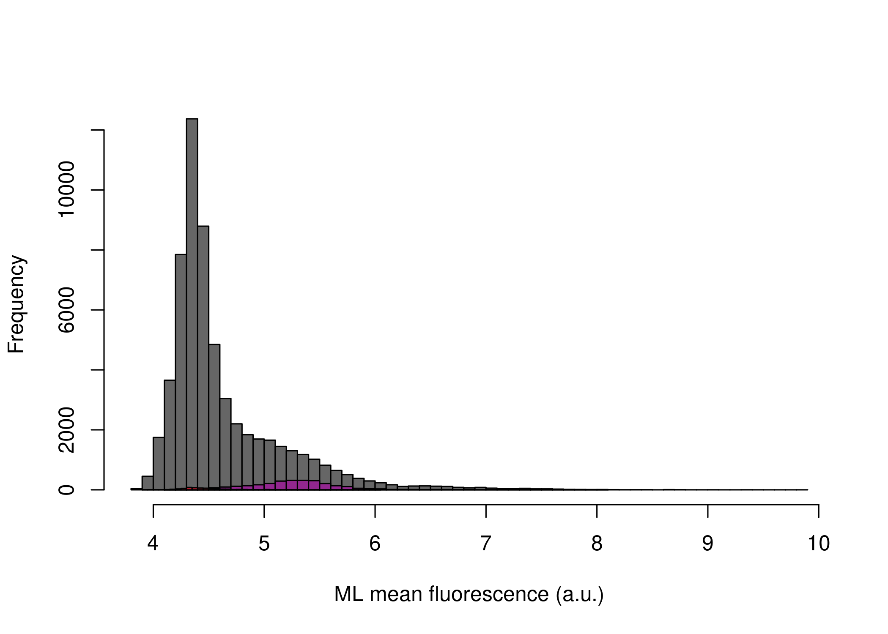
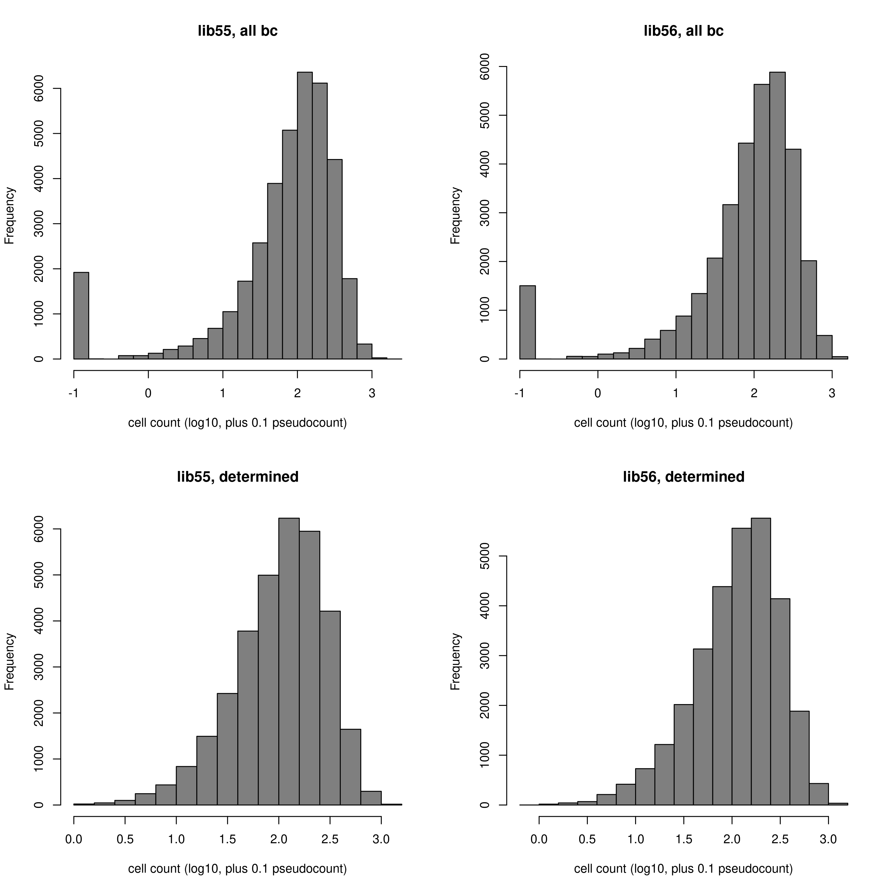
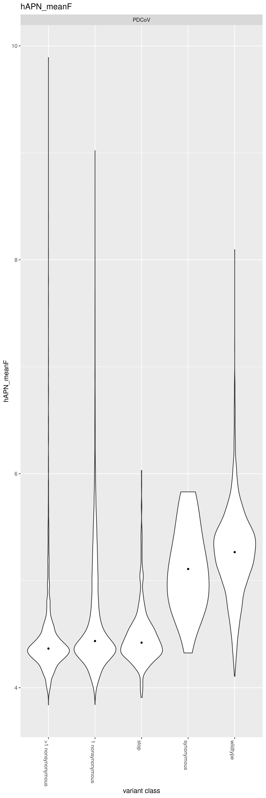

Compute per-barcode hAPN binding
================
Tyler Starr
12/30/2022

This notebook reads in per-barcode counts from `count_variants.ipynb`
for hAPN binding Sort-seq experiments, computes functional scores for
hAPN binding levels, and does some basic QC on variant hAPN functional
scores.

``` r
#list of packages to install/load
packages = c("yaml","data.table","tidyverse","fitdistrplus","gridExtra")
#install any packages not already installed
installed_packages <- packages %in% rownames(installed.packages())
if(any(installed_packages == F)){
  install.packages(packages[!installed_packages],
                   lib=c(paste("/uufs/chpc.utah.edu/common/home/",Sys.getenv("USER"),"/RLibs/",Sys.getenv("R_VERSION"),sep="")),
                   repos=c("http://cran.us.r-project.org"))
}
#load packages
invisible(lapply(packages, library, character.only=T))

knitr::opts_chunk$set(echo = T)
knitr::opts_chunk$set(dev.args = list(png = list(type = "cairo")))

#read in config file
config <- read_yaml("config.yaml")

#make output directory
if(!file.exists(config$binding_scores_dir)){
  dir.create(file.path(config$binding_scores_dir))
}
```

Session info for reproducing environment:

``` r
sessionInfo()
```

    ## R version 4.1.3 (2022-03-10)
    ## Platform: x86_64-pc-linux-gnu (64-bit)
    ## Running under: Rocky Linux 8.8 (Green Obsidian)
    ## 
    ## Matrix products: default
    ## BLAS/LAPACK: /uufs/chpc.utah.edu/sys/spack/linux-rocky8-nehalem/gcc-8.5.0/intel-oneapi-mkl-2021.4.0-h43nkmwzvaltaa6ii5l7n6e7ruvjbmnv/mkl/2021.4.0/lib/intel64/libmkl_rt.so.1
    ## 
    ## locale:
    ##  [1] LC_CTYPE=en_US.UTF-8       LC_NUMERIC=C              
    ##  [3] LC_TIME=en_US.UTF-8        LC_COLLATE=en_US.UTF-8    
    ##  [5] LC_MONETARY=en_US.UTF-8    LC_MESSAGES=en_US.UTF-8   
    ##  [7] LC_PAPER=en_US.UTF-8       LC_NAME=C                 
    ##  [9] LC_ADDRESS=C               LC_TELEPHONE=C            
    ## [11] LC_MEASUREMENT=en_US.UTF-8 LC_IDENTIFICATION=C       
    ## 
    ## attached base packages:
    ## [1] stats     graphics  grDevices utils     datasets  methods   base     
    ## 
    ## other attached packages:
    ##  [1] gridExtra_2.3       fitdistrplus_1.1-11 survival_3.2-13    
    ##  [4] MASS_7.3-55         forcats_0.5.1       stringr_1.4.0      
    ##  [7] dplyr_1.0.8         purrr_0.3.4         readr_2.1.2        
    ## [10] tidyr_1.2.0         tibble_3.1.6        ggplot2_3.4.1      
    ## [13] tidyverse_1.3.1     data.table_1.14.2   yaml_2.3.5         
    ## 
    ## loaded via a namespace (and not attached):
    ##  [1] tidyselect_1.1.2 xfun_0.30        lattice_0.20-45  splines_4.1.3   
    ##  [5] haven_2.4.3      colorspace_2.0-3 vctrs_0.5.2      generics_0.1.2  
    ##  [9] htmltools_0.5.2  utf8_1.2.2       rlang_1.0.6      pillar_1.7.0    
    ## [13] glue_1.6.2       withr_2.5.0      DBI_1.1.2        dbplyr_2.1.1    
    ## [17] modelr_0.1.8     readxl_1.3.1     lifecycle_1.0.3  munsell_0.5.0   
    ## [21] gtable_0.3.0     cellranger_1.1.0 rvest_1.0.2      evaluate_0.15   
    ## [25] knitr_1.37       tzdb_0.2.0       fastmap_1.1.0    fansi_1.0.2     
    ## [29] broom_0.7.12     Rcpp_1.0.11      backports_1.4.1  scales_1.2.1    
    ## [33] jsonlite_1.8.7   fs_1.5.2         hms_1.1.1        digest_0.6.29   
    ## [37] stringi_1.7.6    grid_4.1.3       cli_3.6.0        tools_4.1.3     
    ## [41] magrittr_2.0.2   crayon_1.5.0     pkgconfig_2.0.3  Matrix_1.4-0    
    ## [45] ellipsis_0.3.2   xml2_1.3.3       reprex_2.0.1     lubridate_1.8.0 
    ## [49] rstudioapi_0.13  assertthat_0.2.1 rmarkdown_2.13   httr_1.4.7      
    ## [53] R6_2.5.1         compiler_4.1.3

## Setup

First, we will read in metadata on our sort samples, the table giving
number of reads of each barcode in each of the sort bins, and the
barcode-variant lookup tables, and merge these tables together.

``` r
#read dataframe with list of barcode runs
barcode_runs <- read.csv(file=config$barcode_runs,stringsAsFactors=F); barcode_runs <- subset(barcode_runs, select=-c(R1))

#eliminate rows from barcode_runs that are not from the hAPN sort-seq experiment
barcode_runs <- barcode_runs[barcode_runs$sample_type == "hAPN_sortseq",]

#read file giving count of each barcode in each sort partition
counts <- data.table(read.csv(file=config$variant_counts_file,stringsAsFactors=F))

#eliminate rows from counts that are not part of an hAPN sort-seq bin
counts <- subset(counts, sample %in% barcode_runs[barcode_runs$sample_type=="hAPN_sortseq","sample"])

#read in barcode-variant lookup tables
dt <- data.table(read.csv(file=config$codon_variant_table_file_PDCoV,stringsAsFactors=F))

# #merge, eliminate barcodes duplicated within a library (already done)
# duplicates <- dt[duplicated(dt,by=c("barcode","library")),.(library,barcode)] #the data.table duplciates function annoyingly only flags the first of each duplicate so doesn't intrinsically allow removal of both of the entries of the duplicate. So, flat what are duplciates, and then remove
# dt[,duplicate:=FALSE]
# for(i in 1:nrow(duplicates)){
#   dt[library==duplicates[i,library] & barcode==duplicates[i,barcode],duplicate:=TRUE]
# }
# dt <- dt[duplicate==FALSE,]; dt[,duplicate:=NULL]

dt <- merge(counts, dt, by=c("library","barcode"));rm(counts)
```

Convert from Illumina read counts to estimates of the number of cells
that were sorted into a bin, and add some other useful information to
our data frame.

``` r
#for each bin, normalize the read counts to the observed ratio of cell recovery among bins
for(i in 1:nrow(barcode_runs)){
  lib <- as.character(barcode_runs$library[i])
  bin <- as.character(barcode_runs$sample[i])
  ratio <- sum(dt[library==lib & sample==bin,"count"])/barcode_runs$number_cells[i]
  if(ratio<1){ #if there are fewer reads from a sortseq bin than cells sorted
    dt[library==lib & sample==bin, count.norm := as.numeric(count)] #don't normalize cell counts, make count.norm the same as count
    print(paste("reads < cells for",lib,bin,", un-normalized (ratio",ratio,")")) #print to console to inform of undersampled bins
  }else{
    dt[library==lib & sample==bin, count.norm := as.numeric(count/ratio)] #normalize read counts by the average read:cell ratio, report in new "count.norm" column
    print(paste("read:cell ratio for",lib,bin,"is",ratio))
  }
}
```

    ## [1] "read:cell ratio for lib55 hAPN_01_bin1 is 2.09155293044467"
    ## [1] "read:cell ratio for lib55 hAPN_01_bin2 is 1.14412957483955"
    ## [1] "read:cell ratio for lib55 hAPN_01_bin3 is 7.02920768757835"
    ## [1] "read:cell ratio for lib55 hAPN_01_bin4 is 27.6854235720342"
    ## [1] "read:cell ratio for lib56 hAPN_01_bin1 is 1.18061214631956"
    ## [1] "read:cell ratio for lib56 hAPN_01_bin2 is 2.02156263565074"
    ## [1] "read:cell ratio for lib56 hAPN_01_bin3 is 1.22330139717053"
    ## [1] "read:cell ratio for lib56 hAPN_01_bin4 is 11.6921644272981"

``` r
#annotate each barcode as to whether it's a homolog variant, SARS-CoV-2 wildtype, synonymous muts only, stop, nonsynonymous, >1 nonsynonymous mutations
dt[,variant_class:=as.character(NA)]
dt[n_codon_substitutions==0, variant_class := "wildtype"]
dt[n_codon_substitutions > 0 & n_aa_substitutions==0, variant_class := "synonymous"]
dt[n_aa_substitutions>0 & grepl("*",aa_substitutions,fixed=T), variant_class := "stop"]
dt[n_aa_substitutions == 1 & !grepl("*",aa_substitutions,fixed=T), variant_class := "1 nonsynonymous"]
dt[n_aa_substitutions > 1 & !grepl("*",aa_substitutions,fixed=T), variant_class := ">1 nonsynonymous"]

#cast the data frame into wide format
dt <- dcast(dt, library + barcode + target + variant_class + aa_substitutions + n_aa_substitutions ~ sample, value.var="count.norm")

#add total count corresponding to count across the four bins for each barcode
dt[,hAPN_count := sum(hAPN_01_bin1,hAPN_01_bin2,hAPN_01_bin3,hAPN_01_bin4),by=c("library","barcode")]

#add indicator if count>0 in >1 bin
dt[,total_bins_w_count := sum(.(hAPN_01_bin1,hAPN_01_bin2,hAPN_01_bin3,hAPN_01_bin4)>0),by=c("library","barcode")]
```

## Calculating mean fluorescence

Next, for each barcode, calculate its mean fluorescence as an indicator
of hAPN binding level. We will use a maximum likelihood approach to
determine the mean and standard deviation of fluorescence for a barcode,
given its distribution of cell counts across sort bins, and the known
fluorescence boundaries of those sort bins from the sorting log. The
package `fitdistcens` enables this ML estimation for these type of
*censored* observations, where we know we observed a cell within some
fluorescence interval but do not know the exact fluorescence value
attributed to that observation. The counts are multiplied by 20 so that
there is not a large rounding effect when they are rounded to integers.

``` r
#define function to calculate ML meanF
calc.MLmean <- function(b1,b2,b3,b4,min.b1,min.b2,min.b3,min.b4,max.b4,min.count=1){ #b1-4 gives observed cell counts in bins 1-4; remaining arguments give fluorescence boundaries of the respective bins; min.count gives minimum number of total observations needed across bins in order to calculate meanF (default 1)
  data <- data.frame(left=c(rep(min.b1,round(b1)),rep(min.b2,round(b2)),rep(min.b3,round(b3)),rep(min.b4,round(b4))),
                     right=c(rep(min.b2,round(b1)),rep(min.b3,round(b2)),rep(min.b4,round(b3)),rep(max.b4,round(b4)))) #define data input in format required for fitdistcens
  if(nrow(unique(data))>1 & nrow(data)>min.count){ #only fits if above user-specified min.count, and if the data satisfies the fitdistcens requirement that cells are observed in at least two of the censored partitions to enable ML estimation of identifiable parameters
    fit <- fitdistcens(data,"norm")
    return(list(as.numeric(summary(fit)$estimate["mean"]),as.numeric(summary(fit)$estimate["sd"])))
  } else {
    return(list(as.numeric(NA),as.numeric(NA)))
  }
}

#fit ML mean and sd fluorescence for each barcode, and calculate total cell count as the sum across the four bins. Multiply cell counts by a factor of 20 to minimize rounding errors since fitdistcens requires rounding to integer inputs
invisible(dt[library=="lib55",c("hAPN_meanF","ML_sdF") := tryCatch(calc.MLmean(b1=hAPN_01_bin1*20,b2=hAPN_01_bin2*20,
                                                                      b3=hAPN_01_bin3*20,b4=hAPN_01_bin4*20,
                                                                      min.b1=log(20),min.b2=log(94),min.b3=log(1087),
                                                                      min.b4=log(12349.5),max.b4=log(229000)),
                                                          error=function(e){return(list(as.numeric(NA),as.numeric(NA)))}),by=c("library","barcode")])
invisible(dt[library=="lib56",c("hAPN_meanF","ML_sdF") := tryCatch(calc.MLmean(b1=hAPN_01_bin1*20,b2=hAPN_01_bin2*20,
                                                                      b3=hAPN_01_bin3*20,b4=hAPN_01_bin4*20,
                                                                      min.b1=log(20),min.b2=log(94),min.b3=log(1087),
                                                                      min.b4=log(12349.5),max.b4=log(229000)),
                                                          error=function(e){return(list(as.numeric(NA),as.numeric(NA)))}),by=c("library","barcode")])

#save temp data file for downstream troubleshooting since the ML meanF took >1hr to calculate -- don't use these for final anlaysis though for reproducibility!
save(dt,file=paste(config$binding_scores_dir,"/dt.temp.hAPN.Rda",sep=""))
```

## Basic plotting and QC

Let’s look at the distibution of hAPN scores by variant class for each
library.

``` r
#histogram of mean F, separated by class
hist(dt[variant_class %in% (c("1 nonsynonymous",">1 nonsynonymous")),hAPN_meanF],col="gray40",main="",breaks=50,xlab="ML mean fluorescence (a.u.)")
hist(dt[variant_class %in% (c("synonymous","wildtype")),hAPN_meanF],col="#92278F",add=T,breaks=50)
hist(dt[variant_class %in% (c("stop")),hAPN_meanF],col="#BE1E2D",add=T,breaks=50)
```



Next let’s look at the distributon of cell counts across the four bins
for each barcode, for those for which estimates were generated on the
bottom.

``` r
#histograms
par(mfrow=c(2,2))
hist(log10(dt[library=="lib55",hAPN_count]+0.1),xlab="cell count (log10, plus 0.1 pseudocount)",main="lib55, all bc",col="gray50")
hist(log10(dt[library=="lib56",hAPN_count]+0.1),xlab="cell count (log10, plus 0.1 pseudocount)",main="lib56, all bc",col="gray50")
hist(log10(dt[library=="lib55" & !is.na(hAPN_meanF),hAPN_count]+0.1),xlab="cell count (log10, plus 0.1 pseudocount)",main="lib55, determined",col="gray50")
hist(log10(dt[library=="lib56" & !is.na(hAPN_meanF),hAPN_count]+0.1),xlab="cell count (log10, plus 0.1 pseudocount)",main="lib56, determined",col="gray50")
```



Filter out hAPN_meanF measurements determined from \<10 estimated cells

``` r
min_count <- 10
dt[hAPN_count<min_count, c("hAPN_meanF","ML_sdF","hAPN_count") := NA]
```

Do as violin plots, faceted by each target. In next notebook, we’ll
evaluate count depth and possibly apply further filtering to remove
low-count hAPN_meanF estimates

``` r
p1 <- ggplot(dt[!is.na(hAPN_meanF),],aes(x=variant_class,y=hAPN_meanF))+
  geom_violin(scale="width")+stat_summary(fun=median,geom="point",size=1)+
  ggtitle("hAPN_meanF")+xlab("variant class")+theme(axis.text.x=element_text(angle=-90,hjust=0))+
  facet_wrap(~target,nrow=4)

grid.arrange(p1,ncol=1)
```



``` r
#save pdf
invisible(dev.print(pdf, paste(config$binding_scores_dir,"/violin-plot_meanF-by-target_hAPN.pdf",sep="")))
```

We have generated hAPN_meanF measurements for 86.74% of the barcodes in
our libraries.

## Data Output

Finally, let’s output our measurements for downstream analyses.

``` r
dt[,.(library,barcode,target,variant_class,aa_substitutions,n_aa_substitutions,
     hAPN_count,hAPN_meanF)] %>%
  mutate_if(is.numeric, round, digits=6) %>%
  write.csv(file=config$hAPN_meanF_file, row.names=F)
```
