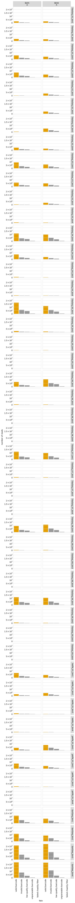

# Count variants in each sample
This Python Jupyter notebook counts occurrences of each barcode in each sample from Illumina barcode sequencing, and adds these counts to the codon variant table.

## Set up analysis
### Import Python modules.
Use [plotnine](https://plotnine.readthedocs.io/en/stable/) for ggplot2-like plotting.

The analysis relies heavily on the Bloom lab's [dms_variants](https://jbloomlab.github.io/dms_variants) package:


```python
import itertools
import multiprocessing
import multiprocessing.pool
import os
import warnings

import alignparse
import alignparse.targets

import dms_variants.codonvarianttable
from dms_variants.constants import CBPALETTE
import dms_variants.illuminabarcodeparser
import dms_variants.utils
import dms_variants.plotnine_themes

from IPython.display import display, HTML

import pandas as pd

from plotnine import *

import yaml

%matplotlib inline
```

Set [plotnine](https://plotnine.readthedocs.io/en/stable/) theme to the gray-grid one defined in `dms_variants`:


```python
theme_set(dms_variants.plotnine_themes.theme_graygrid())
```

Versions of key software:


```python
print(f"Using alignparse version {alignparse.__version__}")
print(f"Using dms_variants version {dms_variants.__version__}")
```

    Using alignparse version 0.6.0
    Using dms_variants version 1.4.3


Ignore warnings that clutter output:


```python
warnings.simplefilter('ignore')
```

### Parameters for notebook
Read the configuration file:


```python
with open('config.yaml') as f:
    config = yaml.safe_load(f)
```

Make output directory if needed:


```python
os.makedirs(config['counts_dir'], exist_ok=True)
os.makedirs(config['figs_dir'], exist_ok=True)
```

## Input variant tables
Initialize the table of barcode-variant pairs from the respective `process_ccs` notebooks for each background.


```python
variants = pd.read_csv(config['codon_variant_table_file_PDCoV'], na_filter=None)

variants = variants.reset_index(drop=True)

display(HTML(variants.head().to_html(index=False)))
```


<table border="1" class="dataframe">
  <thead>
    <tr style="text-align: right;">
      <th>target</th>
      <th>library</th>
      <th>barcode</th>
      <th>variant_call_support</th>
      <th>codon_substitutions</th>
      <th>aa_substitutions</th>
      <th>n_codon_substitutions</th>
      <th>n_aa_substitutions</th>
    </tr>
  </thead>
  <tbody>
    <tr>
      <td>PDCoV</td>
      <td>lib55</td>
      <td>AAAAAAAAAAAACGAC</td>
      <td>4</td>
      <td>GCC12TTG ACC111GAA</td>
      <td>A12L T111E</td>
      <td>2</td>
      <td>2</td>
    </tr>
    <tr>
      <td>PDCoV</td>
      <td>lib55</td>
      <td>AAAAAAAAAACCTGTG</td>
      <td>1</td>
      <td>TTC45GAT</td>
      <td>F45D</td>
      <td>1</td>
      <td>1</td>
    </tr>
    <tr>
      <td>PDCoV</td>
      <td>lib55</td>
      <td>AAAAAAAAAAGTAGGA</td>
      <td>2</td>
      <td>TGT33TTG</td>
      <td>C33L</td>
      <td>1</td>
      <td>1</td>
    </tr>
    <tr>
      <td>PDCoV</td>
      <td>lib55</td>
      <td>AAAAAAAAAGGGGTCC</td>
      <td>2</td>
      <td>TGT84TAT</td>
      <td>C84Y</td>
      <td>1</td>
      <td>1</td>
    </tr>
    <tr>
      <td>PDCoV</td>
      <td>lib55</td>
      <td>AAAAAAAAATAGTACT</td>
      <td>1</td>
      <td>TCC73GAT</td>
      <td>S73D</td>
      <td>1</td>
      <td>1</td>
    </tr>
  </tbody>
</table>


Are there any barcodes in the same library that are shared across targets?
If so, we need to get rid of those as they will be confounded in barcode parsing:


```python
dup_barcodes = (
    variants
    .groupby(['library', 'barcode'])
    .size()
    .rename('duplicate_count')
    .reset_index()
    .query('duplicate_count > 1')
    )

print('Here are duplicated barcodes:')
display(HTML(dup_barcodes.head().to_html(index=False)))

print(f"\nRemoving the {len(dup_barcodes)} duplicated barcodes."
      f"Started with {len(variants)} barcodes:")
variants = (
    variants
    .merge(dup_barcodes, on=['library', 'barcode'], how='outer')
    .query('duplicate_count.isnull()', engine='python')
    )
print(f"After removing duplicates, there are {len(variants)} barcodes.")
```

    Here are duplicated barcodes:


<table border="1" class="dataframe">
  <thead>
    <tr style="text-align: right;">
      <th>library</th>
      <th>barcode</th>
      <th>duplicate_count</th>
    </tr>
  </thead>
  <tbody>
  </tbody>
</table>


    
    Removing the 0 duplicated barcodes.Started with 70499 barcodes:
    After removing duplicates, there are 70499 barcodes.


Pull out a target sequence for matching to the barcode and flanking sequence regions. Note, in this pipeline this is ok because our different backgrounds don't have differing flanks or other features within the actual N16 region covered in Illumina sequencing. If ever placing in-line barcodes here in the future, we would need to modify this.


```python
# get wildtype gene sequence for primary target
targets = alignparse.targets.Targets(seqsfile=config['amplicons_PDCoV'],
                                     feature_parse_specs=config['feature_parse_specs_PDCoV'])
```

## Setup to parse barcodes
Read data frame with list of all barcode runs.


```python
# barcode runs with R1 files by semicolon string split
barcode_runs = (pd.read_csv(config['barcode_runs'])
                .assign(R1=lambda x: x['R1'].str.split('; '))
                )

display(HTML(barcode_runs.to_html(index=False)))
```


<table border="1" class="dataframe">
  <thead>
    <tr style="text-align: right;">
      <th>library</th>
      <th>replicate</th>
      <th>sample</th>
      <th>sample_type</th>
      <th>sort_bin</th>
      <th>concentration</th>
      <th>date</th>
      <th>number_cells</th>
      <th>R1</th>
    </tr>
  </thead>
  <tbody>
    <tr>
      <td>lib55</td>
      <td>A</td>
      <td>TiteSeq_01_bin1</td>
      <td>TiteSeq</td>
      <td>1</td>
      <td>1.0</td>
      <td>221207</td>
      <td>576339</td>
      <td>[/uufs/chpc.utah.edu/common/home/u6042467/starr-group1/sequencing/TNS/2022/221228_PD-CoV-DMS_bc-seq/221207_s1_b1_S1_R1_001.fastq.gz]</td>
    </tr>
    <tr>
      <td>lib55</td>
      <td>A</td>
      <td>TiteSeq_01_bin2</td>
      <td>TiteSeq</td>
      <td>2</td>
      <td>1.0</td>
      <td>221207</td>
      <td>1013945</td>
      <td>[/uufs/chpc.utah.edu/common/home/u6042467/starr-group1/sequencing/TNS/2022/221228_PD-CoV-DMS_bc-seq/221207_s1_b2_S2_R1_001.fastq.gz]</td>
    </tr>
    <tr>
      <td>lib55</td>
      <td>A</td>
      <td>TiteSeq_01_bin3</td>
      <td>TiteSeq</td>
      <td>3</td>
      <td>1.0</td>
      <td>221207</td>
      <td>1643755</td>
      <td>[/uufs/chpc.utah.edu/common/home/u6042467/starr-group1/sequencing/TNS/2022/221228_PD-CoV-DMS_bc-seq/221207_s1_b3_S3_R1_001.fastq.gz]</td>
    </tr>
    <tr>
      <td>lib55</td>
      <td>A</td>
      <td>TiteSeq_01_bin4</td>
      <td>TiteSeq</td>
      <td>4</td>
      <td>1.0</td>
      <td>221207</td>
      <td>1850778</td>
      <td>[/uufs/chpc.utah.edu/common/home/u6042467/starr-group1/sequencing/TNS/2022/221228_PD-CoV-DMS_bc-seq/221207_s1_b4_S4_R1_001.fastq.gz]</td>
    </tr>
    <tr>
      <td>lib55</td>
      <td>A</td>
      <td>TiteSeq_02_bin1</td>
      <td>TiteSeq</td>
      <td>1</td>
      <td>2.0</td>
      <td>221207</td>
      <td>1048743</td>
      <td>[/uufs/chpc.utah.edu/common/home/u6042467/starr-group1/sequencing/TNS/2022/221228_PD-CoV-DMS_bc-seq/221207_s2_b1_S5_R1_001.fastq.gz]</td>
    </tr>
    <tr>
      <td>lib55</td>
      <td>A</td>
      <td>TiteSeq_02_bin2</td>
      <td>TiteSeq</td>
      <td>2</td>
      <td>2.0</td>
      <td>221207</td>
      <td>1143654</td>
      <td>[/uufs/chpc.utah.edu/common/home/u6042467/starr-group1/sequencing/TNS/2022/221228_PD-CoV-DMS_bc-seq/221207_s2_b2_S6_R1_001.fastq.gz]</td>
    </tr>
    <tr>
      <td>lib55</td>
      <td>A</td>
      <td>TiteSeq_02_bin3</td>
      <td>TiteSeq</td>
      <td>3</td>
      <td>2.0</td>
      <td>221207</td>
      <td>1767189</td>
      <td>[/uufs/chpc.utah.edu/common/home/u6042467/starr-group1/sequencing/TNS/2022/221228_PD-CoV-DMS_bc-seq/221207_s2_b3_S7_R1_001.fastq.gz]</td>
    </tr>
    <tr>
      <td>lib55</td>
      <td>A</td>
      <td>TiteSeq_02_bin4</td>
      <td>TiteSeq</td>
      <td>4</td>
      <td>2.0</td>
      <td>221207</td>
      <td>1142166</td>
      <td>[/uufs/chpc.utah.edu/common/home/u6042467/starr-group1/sequencing/TNS/2022/221228_PD-CoV-DMS_bc-seq/221207_s2_b4_S8_R1_001.fastq.gz]</td>
    </tr>
    <tr>
      <td>lib55</td>
      <td>A</td>
      <td>TiteSeq_03_bin1</td>
      <td>TiteSeq</td>
      <td>1</td>
      <td>3.0</td>
      <td>221207</td>
      <td>2284613</td>
      <td>[/uufs/chpc.utah.edu/common/home/u6042467/starr-group1/sequencing/TNS/2022/221228_PD-CoV-DMS_bc-seq/221207_s3_b1_S9_R1_001.fastq.gz]</td>
    </tr>
    <tr>
      <td>lib55</td>
      <td>A</td>
      <td>TiteSeq_03_bin2</td>
      <td>TiteSeq</td>
      <td>2</td>
      <td>3.0</td>
      <td>221207</td>
      <td>1677978</td>
      <td>[/uufs/chpc.utah.edu/common/home/u6042467/starr-group1/sequencing/TNS/2022/221228_PD-CoV-DMS_bc-seq/221207_s3_b2_S10_R1_001.fastq.gz]</td>
    </tr>
    <tr>
      <td>lib55</td>
      <td>A</td>
      <td>TiteSeq_03_bin3</td>
      <td>TiteSeq</td>
      <td>3</td>
      <td>3.0</td>
      <td>221207</td>
      <td>1324283</td>
      <td>[/uufs/chpc.utah.edu/common/home/u6042467/starr-group1/sequencing/TNS/2022/221228_PD-CoV-DMS_bc-seq/221207_s3_b3_S11_R1_001.fastq.gz]</td>
    </tr>
    <tr>
      <td>lib55</td>
      <td>A</td>
      <td>TiteSeq_03_bin4</td>
      <td>TiteSeq</td>
      <td>4</td>
      <td>3.0</td>
      <td>221207</td>
      <td>123221</td>
      <td>[/uufs/chpc.utah.edu/common/home/u6042467/starr-group1/sequencing/TNS/2022/221228_PD-CoV-DMS_bc-seq/221207_s3_b4_S12_R1_001.fastq.gz]</td>
    </tr>
    <tr>
      <td>lib55</td>
      <td>A</td>
      <td>TiteSeq_04_bin1</td>
      <td>TiteSeq</td>
      <td>1</td>
      <td>4.0</td>
      <td>221207</td>
      <td>3416070</td>
      <td>[/uufs/chpc.utah.edu/common/home/u6042467/starr-group1/sequencing/TNS/2022/221228_PD-CoV-DMS_bc-seq/221207_s4_b1_S13_R1_001.fastq.gz]</td>
    </tr>
    <tr>
      <td>lib55</td>
      <td>A</td>
      <td>TiteSeq_04_bin2</td>
      <td>TiteSeq</td>
      <td>2</td>
      <td>4.0</td>
      <td>221207</td>
      <td>2004230</td>
      <td>[/uufs/chpc.utah.edu/common/home/u6042467/starr-group1/sequencing/TNS/2022/221228_PD-CoV-DMS_bc-seq/221207_s4_b2_S14_R1_001.fastq.gz]</td>
    </tr>
    <tr>
      <td>lib55</td>
      <td>A</td>
      <td>TiteSeq_04_bin3</td>
      <td>TiteSeq</td>
      <td>3</td>
      <td>4.0</td>
      <td>221207</td>
      <td>130400</td>
      <td>[/uufs/chpc.utah.edu/common/home/u6042467/starr-group1/sequencing/TNS/2022/221228_PD-CoV-DMS_bc-seq/221207_s4_b3_S15_R1_001.fastq.gz]</td>
    </tr>
    <tr>
      <td>lib55</td>
      <td>A</td>
      <td>TiteSeq_04_bin4</td>
      <td>TiteSeq</td>
      <td>4</td>
      <td>4.0</td>
      <td>221207</td>
      <td>28184</td>
      <td>[/uufs/chpc.utah.edu/common/home/u6042467/starr-group1/sequencing/TNS/2022/221228_PD-CoV-DMS_bc-seq/221207_s4_b4_S16_R1_001.fastq.gz]</td>
    </tr>
    <tr>
      <td>lib55</td>
      <td>A</td>
      <td>TiteSeq_05_bin1</td>
      <td>TiteSeq</td>
      <td>1</td>
      <td>5.0</td>
      <td>221207</td>
      <td>4733319</td>
      <td>[/uufs/chpc.utah.edu/common/home/u6042467/starr-group1/sequencing/TNS/2022/221228_PD-CoV-DMS_bc-seq/221207_s5_b1_S17_R1_001.fastq.gz]</td>
    </tr>
    <tr>
      <td>lib55</td>
      <td>A</td>
      <td>TiteSeq_05_bin2</td>
      <td>TiteSeq</td>
      <td>2</td>
      <td>5.0</td>
      <td>221207</td>
      <td>427554</td>
      <td>[/uufs/chpc.utah.edu/common/home/u6042467/starr-group1/sequencing/TNS/2022/221228_PD-CoV-DMS_bc-seq/221207_s5_b2_S18_R1_001.fastq.gz]</td>
    </tr>
    <tr>
      <td>lib55</td>
      <td>A</td>
      <td>TiteSeq_05_bin3</td>
      <td>TiteSeq</td>
      <td>3</td>
      <td>5.0</td>
      <td>221207</td>
      <td>11437</td>
      <td>[/uufs/chpc.utah.edu/common/home/u6042467/starr-group1/sequencing/TNS/2022/221228_PD-CoV-DMS_bc-seq/221207_s5_b3_S19_R1_001.fastq.gz]</td>
    </tr>
    <tr>
      <td>lib55</td>
      <td>A</td>
      <td>TiteSeq_05_bin4</td>
      <td>TiteSeq</td>
      <td>4</td>
      <td>5.0</td>
      <td>221207</td>
      <td>4566</td>
      <td>[/uufs/chpc.utah.edu/common/home/u6042467/starr-group1/sequencing/TNS/2022/221228_PD-CoV-DMS_bc-seq/221207_s5_b4_S20_R1_001.fastq.gz]</td>
    </tr>
    <tr>
      <td>lib55</td>
      <td>A</td>
      <td>TiteSeq_06_bin1</td>
      <td>TiteSeq</td>
      <td>1</td>
      <td>6.0</td>
      <td>221207</td>
      <td>4931339</td>
      <td>[/uufs/chpc.utah.edu/common/home/u6042467/starr-group1/sequencing/TNS/2022/221228_PD-CoV-DMS_bc-seq/221207_s6_b1_S21_R1_001.fastq.gz]</td>
    </tr>
    <tr>
      <td>lib55</td>
      <td>A</td>
      <td>TiteSeq_06_bin2</td>
      <td>TiteSeq</td>
      <td>2</td>
      <td>6.0</td>
      <td>221207</td>
      <td>154714</td>
      <td>[/uufs/chpc.utah.edu/common/home/u6042467/starr-group1/sequencing/TNS/2022/221228_PD-CoV-DMS_bc-seq/221207_s6_b2_S22_R1_001.fastq.gz]</td>
    </tr>
    <tr>
      <td>lib55</td>
      <td>A</td>
      <td>TiteSeq_06_bin3</td>
      <td>TiteSeq</td>
      <td>3</td>
      <td>6.0</td>
      <td>221207</td>
      <td>1821</td>
      <td>[/uufs/chpc.utah.edu/common/home/u6042467/starr-group1/sequencing/TNS/2022/221228_PD-CoV-DMS_bc-seq/221207_s6_b3_S23_R1_001.fastq.gz]</td>
    </tr>
    <tr>
      <td>lib55</td>
      <td>A</td>
      <td>TiteSeq_06_bin4</td>
      <td>TiteSeq</td>
      <td>4</td>
      <td>6.0</td>
      <td>221207</td>
      <td>434</td>
      <td>[/uufs/chpc.utah.edu/common/home/u6042467/starr-group1/sequencing/TNS/2022/221228_PD-CoV-DMS_bc-seq/221207_s6_b4_S24_R1_001.fastq.gz]</td>
    </tr>
    <tr>
      <td>lib55</td>
      <td>A</td>
      <td>TiteSeq_07_bin1</td>
      <td>TiteSeq</td>
      <td>1</td>
      <td>7.0</td>
      <td>221207</td>
      <td>4991202</td>
      <td>[/uufs/chpc.utah.edu/common/home/u6042467/starr-group1/sequencing/TNS/2022/221228_PD-CoV-DMS_bc-seq/221207_s7_b1_S25_R1_001.fastq.gz]</td>
    </tr>
    <tr>
      <td>lib55</td>
      <td>A</td>
      <td>TiteSeq_07_bin2</td>
      <td>TiteSeq</td>
      <td>2</td>
      <td>7.0</td>
      <td>221207</td>
      <td>137754</td>
      <td>[/uufs/chpc.utah.edu/common/home/u6042467/starr-group1/sequencing/TNS/2022/221228_PD-CoV-DMS_bc-seq/221207_s7_b2_S26_R1_001.fastq.gz]</td>
    </tr>
    <tr>
      <td>lib55</td>
      <td>A</td>
      <td>TiteSeq_07_bin3</td>
      <td>TiteSeq</td>
      <td>3</td>
      <td>7.0</td>
      <td>221207</td>
      <td>1260</td>
      <td>[/uufs/chpc.utah.edu/common/home/u6042467/starr-group1/sequencing/TNS/2022/221228_PD-CoV-DMS_bc-seq/221207_s7_b3_S27_R1_001.fastq.gz]</td>
    </tr>
    <tr>
      <td>lib55</td>
      <td>A</td>
      <td>TiteSeq_07_bin4</td>
      <td>TiteSeq</td>
      <td>4</td>
      <td>7.0</td>
      <td>221207</td>
      <td>70</td>
      <td>[/uufs/chpc.utah.edu/common/home/u6042467/starr-group1/sequencing/TNS/2022/221228_PD-CoV-DMS_bc-seq/221207_s7_b4_S28_R1_001.fastq.gz]</td>
    </tr>
    <tr>
      <td>lib55</td>
      <td>A</td>
      <td>TiteSeq_08_bin1</td>
      <td>TiteSeq</td>
      <td>1</td>
      <td>8.0</td>
      <td>221207</td>
      <td>5012941</td>
      <td>[/uufs/chpc.utah.edu/common/home/u6042467/starr-group1/sequencing/TNS/2022/221228_PD-CoV-DMS_bc-seq/221207_s8_b1_S29_R1_001.fastq.gz]</td>
    </tr>
    <tr>
      <td>lib55</td>
      <td>A</td>
      <td>TiteSeq_08_bin2</td>
      <td>TiteSeq</td>
      <td>2</td>
      <td>8.0</td>
      <td>221207</td>
      <td>131114</td>
      <td>[/uufs/chpc.utah.edu/common/home/u6042467/starr-group1/sequencing/TNS/2022/221228_PD-CoV-DMS_bc-seq/221207_s8_b2_S30_R1_001.fastq.gz]</td>
    </tr>
    <tr>
      <td>lib55</td>
      <td>A</td>
      <td>TiteSeq_08_bin3</td>
      <td>TiteSeq</td>
      <td>3</td>
      <td>8.0</td>
      <td>221207</td>
      <td>916</td>
      <td>[/uufs/chpc.utah.edu/common/home/u6042467/starr-group1/sequencing/TNS/2022/221228_PD-CoV-DMS_bc-seq/221207_s8_b3_S31_R1_001.fastq.gz]</td>
    </tr>
    <tr>
      <td>lib55</td>
      <td>A</td>
      <td>TiteSeq_08_bin4</td>
      <td>TiteSeq</td>
      <td>4</td>
      <td>8.0</td>
      <td>221207</td>
      <td>24</td>
      <td>[/uufs/chpc.utah.edu/common/home/u6042467/starr-group1/sequencing/TNS/2022/221228_PD-CoV-DMS_bc-seq/221207_s8_b4_S32_R1_001.fastq.gz]</td>
    </tr>
    <tr>
      <td>lib55</td>
      <td>A</td>
      <td>TiteSeq_09_bin1</td>
      <td>TiteSeq</td>
      <td>1</td>
      <td>9.0</td>
      <td>221207</td>
      <td>4923572</td>
      <td>[/uufs/chpc.utah.edu/common/home/u6042467/starr-group1/sequencing/TNS/2022/221228_PD-CoV-DMS_bc-seq/221207_s9_b1_S33_R1_001.fastq.gz]</td>
    </tr>
    <tr>
      <td>lib55</td>
      <td>A</td>
      <td>TiteSeq_09_bin2</td>
      <td>TiteSeq</td>
      <td>2</td>
      <td>9.0</td>
      <td>221207</td>
      <td>250693</td>
      <td>[/uufs/chpc.utah.edu/common/home/u6042467/starr-group1/sequencing/TNS/2022/221228_PD-CoV-DMS_bc-seq/221207_s9_b2_S34_R1_001.fastq.gz]</td>
    </tr>
    <tr>
      <td>lib55</td>
      <td>A</td>
      <td>TiteSeq_09_bin3</td>
      <td>TiteSeq</td>
      <td>3</td>
      <td>9.0</td>
      <td>221207</td>
      <td>558</td>
      <td>[/uufs/chpc.utah.edu/common/home/u6042467/starr-group1/sequencing/TNS/2022/221228_PD-CoV-DMS_bc-seq/221207_s9_b3_S35_R1_001.fastq.gz]</td>
    </tr>
    <tr>
      <td>lib55</td>
      <td>A</td>
      <td>TiteSeq_09_bin4</td>
      <td>TiteSeq</td>
      <td>4</td>
      <td>9.0</td>
      <td>221207</td>
      <td>25</td>
      <td>[/uufs/chpc.utah.edu/common/home/u6042467/starr-group1/sequencing/TNS/2022/221228_PD-CoV-DMS_bc-seq/221207_s9_b4_S36_R1_001.fastq.gz]</td>
    </tr>
    <tr>
      <td>lib55</td>
      <td>A</td>
      <td>hAPN_01_bin1</td>
      <td>hAPN_sortseq</td>
      <td>1</td>
      <td>1.0</td>
      <td>221207</td>
      <td>3198849</td>
      <td>[/uufs/chpc.utah.edu/common/home/u6042467/starr-group1/sequencing/TNS/2022/221228_PD-CoV-DMS_bc-seq/221207_s10_b1_S37_R1_001.fastq.gz]</td>
    </tr>
    <tr>
      <td>lib55</td>
      <td>A</td>
      <td>hAPN_01_bin2</td>
      <td>hAPN_sortseq</td>
      <td>2</td>
      <td>1.0</td>
      <td>221207</td>
      <td>1965752</td>
      <td>[/uufs/chpc.utah.edu/common/home/u6042467/starr-group1/sequencing/TNS/2022/221228_PD-CoV-DMS_bc-seq/221207_s10_b2_S38_R1_001.fastq.gz]</td>
    </tr>
    <tr>
      <td>lib55</td>
      <td>A</td>
      <td>hAPN_01_bin3</td>
      <td>hAPN_sortseq</td>
      <td>3</td>
      <td>1.0</td>
      <td>221207</td>
      <td>125241</td>
      <td>[/uufs/chpc.utah.edu/common/home/u6042467/starr-group1/sequencing/TNS/2022/221228_PD-CoV-DMS_bc-seq/221207_s10_b3_S39_R1_001.fastq.gz]</td>
    </tr>
    <tr>
      <td>lib55</td>
      <td>A</td>
      <td>hAPN_01_bin4</td>
      <td>hAPN_sortseq</td>
      <td>4</td>
      <td>1.0</td>
      <td>221207</td>
      <td>12973</td>
      <td>[/uufs/chpc.utah.edu/common/home/u6042467/starr-group1/sequencing/TNS/2022/221228_PD-CoV-DMS_bc-seq/221207_s10_b4_S40_R1_001.fastq.gz]</td>
    </tr>
    <tr>
      <td>lib55</td>
      <td>A</td>
      <td>pAPN_01_bin1</td>
      <td>pAPN_sortseq</td>
      <td>1</td>
      <td>1.0</td>
      <td>221207</td>
      <td>2294711</td>
      <td>[/uufs/chpc.utah.edu/common/home/u6042467/starr-group1/sequencing/TNS/2022/221228_PD-CoV-DMS_bc-seq/221207_s11_b1_S41_R1_001.fastq.gz]</td>
    </tr>
    <tr>
      <td>lib55</td>
      <td>A</td>
      <td>pAPN_01_bin2</td>
      <td>pAPN_sortseq</td>
      <td>2</td>
      <td>1.0</td>
      <td>221207</td>
      <td>2785686</td>
      <td>[/uufs/chpc.utah.edu/common/home/u6042467/starr-group1/sequencing/TNS/2022/221228_PD-CoV-DMS_bc-seq/221207_s11_b2_S42_R1_001.fastq.gz]</td>
    </tr>
    <tr>
      <td>lib55</td>
      <td>A</td>
      <td>pAPN_01_bin3</td>
      <td>pAPN_sortseq</td>
      <td>3</td>
      <td>1.0</td>
      <td>221207</td>
      <td>114535</td>
      <td>[/uufs/chpc.utah.edu/common/home/u6042467/starr-group1/sequencing/TNS/2022/221228_PD-CoV-DMS_bc-seq/221207_s11_b3_S43_R1_001.fastq.gz]</td>
    </tr>
    <tr>
      <td>lib55</td>
      <td>A</td>
      <td>pAPN_01_bin4</td>
      <td>pAPN_sortseq</td>
      <td>4</td>
      <td>1.0</td>
      <td>221207</td>
      <td>6556</td>
      <td>[/uufs/chpc.utah.edu/common/home/u6042467/starr-group1/sequencing/TNS/2022/221228_PD-CoV-DMS_bc-seq/221207_s11_b4_S44_R1_001.fastq.gz]</td>
    </tr>
    <tr>
      <td>lib56</td>
      <td>A</td>
      <td>TiteSeq_01_bin1</td>
      <td>TiteSeq</td>
      <td>1</td>
      <td>1.0</td>
      <td>221209</td>
      <td>964285</td>
      <td>[/uufs/chpc.utah.edu/common/home/u6042467/starr-group1/sequencing/TNS/2022/221228_PD-CoV-DMS_bc-seq/221209_s1_b1_S45_R1_001.fastq.gz]</td>
    </tr>
    <tr>
      <td>lib56</td>
      <td>A</td>
      <td>TiteSeq_01_bin2</td>
      <td>TiteSeq</td>
      <td>2</td>
      <td>1.0</td>
      <td>221209</td>
      <td>962892</td>
      <td>[/uufs/chpc.utah.edu/common/home/u6042467/starr-group1/sequencing/TNS/2022/221228_PD-CoV-DMS_bc-seq/221209_s1_b2_S46_R1_001.fastq.gz]</td>
    </tr>
    <tr>
      <td>lib56</td>
      <td>A</td>
      <td>TiteSeq_01_bin3</td>
      <td>TiteSeq</td>
      <td>3</td>
      <td>1.0</td>
      <td>221209</td>
      <td>1543533</td>
      <td>[/uufs/chpc.utah.edu/common/home/u6042467/starr-group1/sequencing/TNS/2022/221228_PD-CoV-DMS_bc-seq/221209_s1_b3_S47_R1_001.fastq.gz]</td>
    </tr>
    <tr>
      <td>lib56</td>
      <td>A</td>
      <td>TiteSeq_01_bin4</td>
      <td>TiteSeq</td>
      <td>4</td>
      <td>1.0</td>
      <td>221209</td>
      <td>1755272</td>
      <td>[/uufs/chpc.utah.edu/common/home/u6042467/starr-group1/sequencing/TNS/2022/221228_PD-CoV-DMS_bc-seq/221209_s1_b4_S48_R1_001.fastq.gz]</td>
    </tr>
    <tr>
      <td>lib56</td>
      <td>A</td>
      <td>TiteSeq_02_bin1</td>
      <td>TiteSeq</td>
      <td>1</td>
      <td>2.0</td>
      <td>221209</td>
      <td>1338117</td>
      <td>[/uufs/chpc.utah.edu/common/home/u6042467/starr-group1/sequencing/TNS/2022/221228_PD-CoV-DMS_bc-seq/221209_s2_b1_S49_R1_001.fastq.gz]</td>
    </tr>
    <tr>
      <td>lib56</td>
      <td>A</td>
      <td>TiteSeq_02_bin2</td>
      <td>TiteSeq</td>
      <td>2</td>
      <td>2.0</td>
      <td>221209</td>
      <td>1349278</td>
      <td>[/uufs/chpc.utah.edu/common/home/u6042467/starr-group1/sequencing/TNS/2022/221228_PD-CoV-DMS_bc-seq/221209_s2_b2_S50_R1_001.fastq.gz]</td>
    </tr>
    <tr>
      <td>lib56</td>
      <td>A</td>
      <td>TiteSeq_02_bin3</td>
      <td>TiteSeq</td>
      <td>3</td>
      <td>2.0</td>
      <td>221209</td>
      <td>1830736</td>
      <td>[/uufs/chpc.utah.edu/common/home/u6042467/starr-group1/sequencing/TNS/2022/221228_PD-CoV-DMS_bc-seq/221209_s2_b3_S51_R1_001.fastq.gz]</td>
    </tr>
    <tr>
      <td>lib56</td>
      <td>A</td>
      <td>TiteSeq_02_bin4</td>
      <td>TiteSeq</td>
      <td>4</td>
      <td>2.0</td>
      <td>221209</td>
      <td>876417</td>
      <td>[/uufs/chpc.utah.edu/common/home/u6042467/starr-group1/sequencing/TNS/2022/221228_PD-CoV-DMS_bc-seq/221209_s2_b4_S52_R1_001.fastq.gz]</td>
    </tr>
    <tr>
      <td>lib56</td>
      <td>A</td>
      <td>TiteSeq_03_bin1</td>
      <td>TiteSeq</td>
      <td>1</td>
      <td>3.0</td>
      <td>221209</td>
      <td>2422983</td>
      <td>[/uufs/chpc.utah.edu/common/home/u6042467/starr-group1/sequencing/TNS/2022/221228_PD-CoV-DMS_bc-seq/221209_s3_b1_S53_R1_001.fastq.gz]</td>
    </tr>
    <tr>
      <td>lib56</td>
      <td>A</td>
      <td>TiteSeq_03_bin2</td>
      <td>TiteSeq</td>
      <td>2</td>
      <td>3.0</td>
      <td>221209</td>
      <td>1866638</td>
      <td>[/uufs/chpc.utah.edu/common/home/u6042467/starr-group1/sequencing/TNS/2022/221228_PD-CoV-DMS_bc-seq/221209_s3_b2_S54_R1_001.fastq.gz]</td>
    </tr>
    <tr>
      <td>lib56</td>
      <td>A</td>
      <td>TiteSeq_03_bin3</td>
      <td>TiteSeq</td>
      <td>3</td>
      <td>3.0</td>
      <td>221209</td>
      <td>1005456</td>
      <td>[/uufs/chpc.utah.edu/common/home/u6042467/starr-group1/sequencing/TNS/2022/221228_PD-CoV-DMS_bc-seq/221209_s3_b3_S55_R1_001.fastq.gz]</td>
    </tr>
    <tr>
      <td>lib56</td>
      <td>A</td>
      <td>TiteSeq_03_bin4</td>
      <td>TiteSeq</td>
      <td>4</td>
      <td>3.0</td>
      <td>221209</td>
      <td>76285</td>
      <td>[/uufs/chpc.utah.edu/common/home/u6042467/starr-group1/sequencing/TNS/2022/221228_PD-CoV-DMS_bc-seq/221209_s3_b4_S56_R1_001.fastq.gz]</td>
    </tr>
    <tr>
      <td>lib56</td>
      <td>A</td>
      <td>TiteSeq_04_bin1</td>
      <td>TiteSeq</td>
      <td>1</td>
      <td>4.0</td>
      <td>221209</td>
      <td>3799329</td>
      <td>[/uufs/chpc.utah.edu/common/home/u6042467/starr-group1/sequencing/TNS/2022/221228_PD-CoV-DMS_bc-seq/221209_s4_b1_S57_R1_001.fastq.gz]</td>
    </tr>
    <tr>
      <td>lib56</td>
      <td>A</td>
      <td>TiteSeq_04_bin2</td>
      <td>TiteSeq</td>
      <td>2</td>
      <td>4.0</td>
      <td>221209</td>
      <td>1402025</td>
      <td>[/uufs/chpc.utah.edu/common/home/u6042467/starr-group1/sequencing/TNS/2022/221228_PD-CoV-DMS_bc-seq/221209_s4_b2_S58_R1_001.fastq.gz]</td>
    </tr>
    <tr>
      <td>lib56</td>
      <td>A</td>
      <td>TiteSeq_04_bin3</td>
      <td>TiteSeq</td>
      <td>3</td>
      <td>4.0</td>
      <td>221209</td>
      <td>61072</td>
      <td>[/uufs/chpc.utah.edu/common/home/u6042467/starr-group1/sequencing/TNS/2022/221228_PD-CoV-DMS_bc-seq/221209_s4_b3_S59_R1_001.fastq.gz]</td>
    </tr>
    <tr>
      <td>lib56</td>
      <td>A</td>
      <td>TiteSeq_04_bin4</td>
      <td>TiteSeq</td>
      <td>4</td>
      <td>4.0</td>
      <td>221209</td>
      <td>14107</td>
      <td>[/uufs/chpc.utah.edu/common/home/u6042467/starr-group1/sequencing/TNS/2022/221228_PD-CoV-DMS_bc-seq/221209_s4_b4_S60_R1_001.fastq.gz]</td>
    </tr>
    <tr>
      <td>lib56</td>
      <td>A</td>
      <td>TiteSeq_05_bin1</td>
      <td>TiteSeq</td>
      <td>1</td>
      <td>5.0</td>
      <td>221209</td>
      <td>4765923</td>
      <td>[/uufs/chpc.utah.edu/common/home/u6042467/starr-group1/sequencing/TNS/2022/221228_PD-CoV-DMS_bc-seq/221209_s5_b1_S61_R1_001.fastq.gz]</td>
    </tr>
    <tr>
      <td>lib56</td>
      <td>A</td>
      <td>TiteSeq_05_bin2</td>
      <td>TiteSeq</td>
      <td>2</td>
      <td>5.0</td>
      <td>221209</td>
      <td>363923</td>
      <td>[/uufs/chpc.utah.edu/common/home/u6042467/starr-group1/sequencing/TNS/2022/221228_PD-CoV-DMS_bc-seq/221209_s5_b2_S62_R1_001.fastq.gz]</td>
    </tr>
    <tr>
      <td>lib56</td>
      <td>A</td>
      <td>TiteSeq_05_bin3</td>
      <td>TiteSeq</td>
      <td>3</td>
      <td>5.0</td>
      <td>221209</td>
      <td>10732</td>
      <td>[/uufs/chpc.utah.edu/common/home/u6042467/starr-group1/sequencing/TNS/2022/221228_PD-CoV-DMS_bc-seq/221209_s5_b3_S63_R1_001.fastq.gz]</td>
    </tr>
    <tr>
      <td>lib56</td>
      <td>A</td>
      <td>TiteSeq_05_bin4</td>
      <td>TiteSeq</td>
      <td>4</td>
      <td>5.0</td>
      <td>221209</td>
      <td>1670</td>
      <td>[/uufs/chpc.utah.edu/common/home/u6042467/starr-group1/sequencing/TNS/2022/221228_PD-CoV-DMS_bc-seq/221209_s5_b4_S64_R1_001.fastq.gz]</td>
    </tr>
    <tr>
      <td>lib56</td>
      <td>A</td>
      <td>TiteSeq_06_bin1</td>
      <td>TiteSeq</td>
      <td>1</td>
      <td>6.0</td>
      <td>221209</td>
      <td>4978827</td>
      <td>[/uufs/chpc.utah.edu/common/home/u6042467/starr-group1/sequencing/TNS/2022/221228_PD-CoV-DMS_bc-seq/221209_s6_b1_S65_R1_001.fastq.gz]</td>
    </tr>
    <tr>
      <td>lib56</td>
      <td>A</td>
      <td>TiteSeq_06_bin2</td>
      <td>TiteSeq</td>
      <td>2</td>
      <td>6.0</td>
      <td>221209</td>
      <td>98231</td>
      <td>[/uufs/chpc.utah.edu/common/home/u6042467/starr-group1/sequencing/TNS/2022/221228_PD-CoV-DMS_bc-seq/221209_s6_b2_S66_R1_001.fastq.gz]</td>
    </tr>
    <tr>
      <td>lib56</td>
      <td>A</td>
      <td>TiteSeq_06_bin3</td>
      <td>TiteSeq</td>
      <td>3</td>
      <td>6.0</td>
      <td>221209</td>
      <td>2021</td>
      <td>[/uufs/chpc.utah.edu/common/home/u6042467/starr-group1/sequencing/TNS/2022/221228_PD-CoV-DMS_bc-seq/221209_s6_b3_S67_R1_001.fastq.gz]</td>
    </tr>
    <tr>
      <td>lib56</td>
      <td>A</td>
      <td>TiteSeq_06_bin4</td>
      <td>TiteSeq</td>
      <td>4</td>
      <td>6.0</td>
      <td>221209</td>
      <td>189</td>
      <td>[/uufs/chpc.utah.edu/common/home/u6042467/starr-group1/sequencing/TNS/2022/221228_PD-CoV-DMS_bc-seq/221209_s6_b4_S68_R1_001.fastq.gz]</td>
    </tr>
    <tr>
      <td>lib56</td>
      <td>A</td>
      <td>TiteSeq_07_bin1</td>
      <td>TiteSeq</td>
      <td>1</td>
      <td>7.0</td>
      <td>221209</td>
      <td>4917222</td>
      <td>[/uufs/chpc.utah.edu/common/home/u6042467/starr-group1/sequencing/TNS/2022/221228_PD-CoV-DMS_bc-seq/221209_s7_b1_S69_R1_001.fastq.gz]</td>
    </tr>
    <tr>
      <td>lib56</td>
      <td>A</td>
      <td>TiteSeq_07_bin2</td>
      <td>TiteSeq</td>
      <td>2</td>
      <td>7.0</td>
      <td>221209</td>
      <td>122338</td>
      <td>[/uufs/chpc.utah.edu/common/home/u6042467/starr-group1/sequencing/TNS/2022/221228_PD-CoV-DMS_bc-seq/221209_s7_b2_S70_R1_001.fastq.gz]</td>
    </tr>
    <tr>
      <td>lib56</td>
      <td>A</td>
      <td>TiteSeq_07_bin3</td>
      <td>TiteSeq</td>
      <td>3</td>
      <td>7.0</td>
      <td>221209</td>
      <td>2104</td>
      <td>[/uufs/chpc.utah.edu/common/home/u6042467/starr-group1/sequencing/TNS/2022/221228_PD-CoV-DMS_bc-seq/221209_s7_b3_S71_R1_001.fastq.gz]</td>
    </tr>
    <tr>
      <td>lib56</td>
      <td>A</td>
      <td>TiteSeq_07_bin4</td>
      <td>TiteSeq</td>
      <td>4</td>
      <td>7.0</td>
      <td>221209</td>
      <td>77</td>
      <td>[/uufs/chpc.utah.edu/common/home/u6042467/starr-group1/sequencing/TNS/2022/221228_PD-CoV-DMS_bc-seq/221209_s7_b4_S72_R1_001.fastq.gz]</td>
    </tr>
    <tr>
      <td>lib56</td>
      <td>A</td>
      <td>TiteSeq_08_bin1</td>
      <td>TiteSeq</td>
      <td>1</td>
      <td>8.0</td>
      <td>221209</td>
      <td>4929385</td>
      <td>[/uufs/chpc.utah.edu/common/home/u6042467/starr-group1/sequencing/TNS/2022/221228_PD-CoV-DMS_bc-seq/221209_s8_b1_S73_R1_001.fastq.gz]</td>
    </tr>
    <tr>
      <td>lib56</td>
      <td>A</td>
      <td>TiteSeq_08_bin2</td>
      <td>TiteSeq</td>
      <td>2</td>
      <td>8.0</td>
      <td>221209</td>
      <td>107644</td>
      <td>[/uufs/chpc.utah.edu/common/home/u6042467/starr-group1/sequencing/TNS/2022/221228_PD-CoV-DMS_bc-seq/221209_s8_b2_S74_R1_001.fastq.gz]</td>
    </tr>
    <tr>
      <td>lib56</td>
      <td>A</td>
      <td>TiteSeq_08_bin3</td>
      <td>TiteSeq</td>
      <td>3</td>
      <td>8.0</td>
      <td>221209</td>
      <td>2402</td>
      <td>[/uufs/chpc.utah.edu/common/home/u6042467/starr-group1/sequencing/TNS/2022/221228_PD-CoV-DMS_bc-seq/221209_s8_b3_S75_R1_001.fastq.gz]</td>
    </tr>
    <tr>
      <td>lib56</td>
      <td>A</td>
      <td>TiteSeq_08_bin4</td>
      <td>TiteSeq</td>
      <td>4</td>
      <td>8.0</td>
      <td>221209</td>
      <td>52</td>
      <td>[/uufs/chpc.utah.edu/common/home/u6042467/starr-group1/sequencing/TNS/2022/221228_PD-CoV-DMS_bc-seq/221209_s8_b4_S76_R1_001.fastq.gz]</td>
    </tr>
    <tr>
      <td>lib56</td>
      <td>A</td>
      <td>TiteSeq_09_bin1</td>
      <td>TiteSeq</td>
      <td>1</td>
      <td>9.0</td>
      <td>221209</td>
      <td>4912812</td>
      <td>[/uufs/chpc.utah.edu/common/home/u6042467/starr-group1/sequencing/TNS/2022/221228_PD-CoV-DMS_bc-seq/221209_s9_b1_S77_R1_001.fastq.gz]</td>
    </tr>
    <tr>
      <td>lib56</td>
      <td>A</td>
      <td>TiteSeq_09_bin2</td>
      <td>TiteSeq</td>
      <td>2</td>
      <td>9.0</td>
      <td>221209</td>
      <td>228754</td>
      <td>[/uufs/chpc.utah.edu/common/home/u6042467/starr-group1/sequencing/TNS/2022/221228_PD-CoV-DMS_bc-seq/221209_s9_b2_S78_R1_001.fastq.gz]</td>
    </tr>
    <tr>
      <td>lib56</td>
      <td>A</td>
      <td>TiteSeq_09_bin3</td>
      <td>TiteSeq</td>
      <td>3</td>
      <td>9.0</td>
      <td>221209</td>
      <td>270</td>
      <td>[/uufs/chpc.utah.edu/common/home/u6042467/starr-group1/sequencing/TNS/2022/221228_PD-CoV-DMS_bc-seq/221209_s9_b3_S79_R1_001.fastq.gz]</td>
    </tr>
    <tr>
      <td>lib56</td>
      <td>A</td>
      <td>TiteSeq_09_bin4</td>
      <td>TiteSeq</td>
      <td>4</td>
      <td>9.0</td>
      <td>221209</td>
      <td>44</td>
      <td>[/uufs/chpc.utah.edu/common/home/u6042467/starr-group1/sequencing/TNS/2022/221228_PD-CoV-DMS_bc-seq/221209_s9_b4_S80_R1_001.fastq.gz]</td>
    </tr>
    <tr>
      <td>lib56</td>
      <td>A</td>
      <td>hAPN_01_bin1</td>
      <td>hAPN_sortseq</td>
      <td>1</td>
      <td>1.0</td>
      <td>221209</td>
      <td>3167478</td>
      <td>[/uufs/chpc.utah.edu/common/home/u6042467/starr-group1/sequencing/TNS/2022/221228_PD-CoV-DMS_bc-seq/221209_s10_b1_S81_R1_001.fastq.gz]</td>
    </tr>
    <tr>
      <td>lib56</td>
      <td>A</td>
      <td>hAPN_01_bin2</td>
      <td>hAPN_sortseq</td>
      <td>2</td>
      <td>1.0</td>
      <td>221209</td>
      <td>1971976</td>
      <td>[/uufs/chpc.utah.edu/common/home/u6042467/starr-group1/sequencing/TNS/2022/221228_PD-CoV-DMS_bc-seq/221209_s10_b2_S82_R1_001.fastq.gz]</td>
    </tr>
    <tr>
      <td>lib56</td>
      <td>A</td>
      <td>hAPN_01_bin3</td>
      <td>hAPN_sortseq</td>
      <td>3</td>
      <td>1.0</td>
      <td>221209</td>
      <td>113873</td>
      <td>[/uufs/chpc.utah.edu/common/home/u6042467/starr-group1/sequencing/TNS/2022/221228_PD-CoV-DMS_bc-seq/221209_s10_b3_S83_R1_001.fastq.gz]</td>
    </tr>
    <tr>
      <td>lib56</td>
      <td>A</td>
      <td>hAPN_01_bin4</td>
      <td>hAPN_sortseq</td>
      <td>4</td>
      <td>1.0</td>
      <td>221209</td>
      <td>22551</td>
      <td>[/uufs/chpc.utah.edu/common/home/u6042467/starr-group1/sequencing/TNS/2022/221228_PD-CoV-DMS_bc-seq/221209_s10_b4_S84_R1_001.fastq.gz]</td>
    </tr>
    <tr>
      <td>lib56</td>
      <td>A</td>
      <td>pAPN_01_bin1</td>
      <td>pAPN_sortseq</td>
      <td>1</td>
      <td>1.0</td>
      <td>221209</td>
      <td>3335297</td>
      <td>[/uufs/chpc.utah.edu/common/home/u6042467/starr-group1/sequencing/TNS/2022/221228_PD-CoV-DMS_bc-seq/221209_s11_b1_S85_R1_001.fastq.gz]</td>
    </tr>
    <tr>
      <td>lib56</td>
      <td>A</td>
      <td>pAPN_01_bin2</td>
      <td>pAPN_sortseq</td>
      <td>2</td>
      <td>1.0</td>
      <td>221209</td>
      <td>1846808</td>
      <td>[/uufs/chpc.utah.edu/common/home/u6042467/starr-group1/sequencing/TNS/2022/221228_PD-CoV-DMS_bc-seq/221209_s11_b2_S86_R1_001.fastq.gz]</td>
    </tr>
    <tr>
      <td>lib56</td>
      <td>A</td>
      <td>pAPN_01_bin3</td>
      <td>pAPN_sortseq</td>
      <td>3</td>
      <td>1.0</td>
      <td>221209</td>
      <td>84711</td>
      <td>[/uufs/chpc.utah.edu/common/home/u6042467/starr-group1/sequencing/TNS/2022/221228_PD-CoV-DMS_bc-seq/221209_s11_b3_S87_R1_001.fastq.gz]</td>
    </tr>
    <tr>
      <td>lib56</td>
      <td>A</td>
      <td>pAPN_01_bin4</td>
      <td>pAPN_sortseq</td>
      <td>4</td>
      <td>1.0</td>
      <td>221209</td>
      <td>6211</td>
      <td>[/uufs/chpc.utah.edu/common/home/u6042467/starr-group1/sequencing/TNS/2022/221228_PD-CoV-DMS_bc-seq/221209_s11_b4_S88_R1_001.fastq.gz]</td>
    </tr>
    <tr>
      <td>lib55</td>
      <td>A</td>
      <td>SortSeq_bin1</td>
      <td>SortSeq</td>
      <td>1</td>
      <td>NaN</td>
      <td>240426</td>
      <td>2947338</td>
      <td>[/uufs/chpc.utah.edu/common/home/u6042467/starr-group1/sequencing/TNS/2024/240510_Illumina_mAb-escape-expr-PD-CoV/240426-exp1-RBD-bin1-1_R1_001.fastq.gz, /uufs/chpc.utah.edu/common/home/u6042467/starr-group1/sequencing/TNS/2024/240510_Illumina_mAb-escape-expr-PD-CoV/240426-exp1-RBD-bin1-2_R1_001.fastq.gz, /uufs/chpc.utah.edu/common/home/u6042467/starr-group1/sequencing/TNS/2024/240510_Illumina_mAb-escape-expr-PD-CoV/240426-exp1-RBD-bin1-3_R1_001.fastq.gz]</td>
    </tr>
    <tr>
      <td>lib55</td>
      <td>A</td>
      <td>SortSeq_bin2</td>
      <td>SortSeq</td>
      <td>2</td>
      <td>NaN</td>
      <td>240426</td>
      <td>2540256</td>
      <td>[/uufs/chpc.utah.edu/common/home/u6042467/starr-group1/sequencing/TNS/2024/240510_Illumina_mAb-escape-expr-PD-CoV/240426-exp1-RBD-bin2-1_R1_001.fastq.gz, /uufs/chpc.utah.edu/common/home/u6042467/starr-group1/sequencing/TNS/2024/240510_Illumina_mAb-escape-expr-PD-CoV/240426-exp1-RBD-bin2-2_R1_001.fastq.gz, /uufs/chpc.utah.edu/common/home/u6042467/starr-group1/sequencing/TNS/2024/240510_Illumina_mAb-escape-expr-PD-CoV/240426-exp1-RBD-bin2-3_R1_001.fastq.gz]</td>
    </tr>
    <tr>
      <td>lib55</td>
      <td>A</td>
      <td>SortSeq_bin3</td>
      <td>SortSeq</td>
      <td>3</td>
      <td>NaN</td>
      <td>240426</td>
      <td>4747315</td>
      <td>[/uufs/chpc.utah.edu/common/home/u6042467/starr-group1/sequencing/TNS/2024/240510_Illumina_mAb-escape-expr-PD-CoV/240426-exp1-RBD-bin3-1_R1_001.fastq.gz, /uufs/chpc.utah.edu/common/home/u6042467/starr-group1/sequencing/TNS/2024/240510_Illumina_mAb-escape-expr-PD-CoV/240426-exp1-RBD-bin3-2_R1_001.fastq.gz, /uufs/chpc.utah.edu/common/home/u6042467/starr-group1/sequencing/TNS/2024/240510_Illumina_mAb-escape-expr-PD-CoV/240426-exp1-RBD-bin3-3_R1_001.fastq.gz]</td>
    </tr>
    <tr>
      <td>lib55</td>
      <td>A</td>
      <td>SortSeq_bin4</td>
      <td>SortSeq</td>
      <td>4</td>
      <td>NaN</td>
      <td>240426</td>
      <td>5251692</td>
      <td>[/uufs/chpc.utah.edu/common/home/u6042467/starr-group1/sequencing/TNS/2024/240510_Illumina_mAb-escape-expr-PD-CoV/240426-exp1-RBD-bin4-1_R1_001.fastq.gz, /uufs/chpc.utah.edu/common/home/u6042467/starr-group1/sequencing/TNS/2024/240510_Illumina_mAb-escape-expr-PD-CoV/240426-exp1-RBD-bin4-2_R1_001.fastq.gz, /uufs/chpc.utah.edu/common/home/u6042467/starr-group1/sequencing/TNS/2024/240510_Illumina_mAb-escape-expr-PD-CoV/240426-exp1-RBD-bin4-3_R1_001.fastq.gz]</td>
    </tr>
    <tr>
      <td>lib56</td>
      <td>A</td>
      <td>SortSeq_bin1</td>
      <td>SortSeq</td>
      <td>1</td>
      <td>NaN</td>
      <td>240426</td>
      <td>2072673</td>
      <td>[/uufs/chpc.utah.edu/common/home/u6042467/starr-group1/sequencing/TNS/2024/240510_Illumina_mAb-escape-expr-PD-CoV/240426-exp2-RBD-bin1-1_R1_001.fastq.gz, /uufs/chpc.utah.edu/common/home/u6042467/starr-group1/sequencing/TNS/2024/240510_Illumina_mAb-escape-expr-PD-CoV/240426-exp2-RBD-bin1-2_R1_001.fastq.gz, /uufs/chpc.utah.edu/common/home/u6042467/starr-group1/sequencing/TNS/2024/240510_Illumina_mAb-escape-expr-PD-CoV/240426-exp2-RBD-bin1-3_R1_001.fastq.gz]</td>
    </tr>
    <tr>
      <td>lib56</td>
      <td>A</td>
      <td>SortSeq_bin2</td>
      <td>SortSeq</td>
      <td>2</td>
      <td>NaN</td>
      <td>240426</td>
      <td>3007469</td>
      <td>[/uufs/chpc.utah.edu/common/home/u6042467/starr-group1/sequencing/TNS/2024/240510_Illumina_mAb-escape-expr-PD-CoV/240426-exp2-RBD-bin2-1_R1_001.fastq.gz, /uufs/chpc.utah.edu/common/home/u6042467/starr-group1/sequencing/TNS/2024/240510_Illumina_mAb-escape-expr-PD-CoV/240426-exp2-RBD-bin2-2_R1_001.fastq.gz, /uufs/chpc.utah.edu/common/home/u6042467/starr-group1/sequencing/TNS/2024/240510_Illumina_mAb-escape-expr-PD-CoV/240426-exp2-RBD-bin2-3_R1_001.fastq.gz]</td>
    </tr>
    <tr>
      <td>lib56</td>
      <td>A</td>
      <td>SortSeq_bin3</td>
      <td>SortSeq</td>
      <td>3</td>
      <td>NaN</td>
      <td>240426</td>
      <td>6248171</td>
      <td>[/uufs/chpc.utah.edu/common/home/u6042467/starr-group1/sequencing/TNS/2024/240510_Illumina_mAb-escape-expr-PD-CoV/240426-exp2-RBD-bin3-1_R1_001.fastq.gz, /uufs/chpc.utah.edu/common/home/u6042467/starr-group1/sequencing/TNS/2024/240510_Illumina_mAb-escape-expr-PD-CoV/240426-exp2-RBD-bin3-2_R1_001.fastq.gz, /uufs/chpc.utah.edu/common/home/u6042467/starr-group1/sequencing/TNS/2024/240510_Illumina_mAb-escape-expr-PD-CoV/240426-exp2-RBD-bin3-3_R1_001.fastq.gz]</td>
    </tr>
    <tr>
      <td>lib56</td>
      <td>A</td>
      <td>SortSeq_bin4</td>
      <td>SortSeq</td>
      <td>4</td>
      <td>NaN</td>
      <td>240426</td>
      <td>6349419</td>
      <td>[/uufs/chpc.utah.edu/common/home/u6042467/starr-group1/sequencing/TNS/2024/240510_Illumina_mAb-escape-expr-PD-CoV/240426-exp2-RBD-bin4-1_R1_001.fastq.gz, /uufs/chpc.utah.edu/common/home/u6042467/starr-group1/sequencing/TNS/2024/240510_Illumina_mAb-escape-expr-PD-CoV/240426-exp2-RBD-bin4-2_R1_001.fastq.gz, /uufs/chpc.utah.edu/common/home/u6042467/starr-group1/sequencing/TNS/2024/240510_Illumina_mAb-escape-expr-PD-CoV/240426-exp2-RBD-bin4-3_R1_001.fastq.gz]</td>
    </tr>
  </tbody>
</table>


Make sure library / sample combinations are unique:


```python
assert len(barcode_runs) == len(barcode_runs.groupby(['library', 'replicate', 'sample']))
```

Make sure the the libraries for which we have barcode runs are all in our variant table:


```python
unknown_libs = set(barcode_runs['library']) - set(variants['library'])
if unknown_libs:
    raise ValueError(f"Libraries with barcode runs not in variant table: {unknown_libs}")
```

Now we initialize an [IlluminaBarcodeParser](https://jbloomlab.github.io/dms_variants/dms_variants.illuminabarcodeparser.html#dms_variants.illuminabarcodeparser.IlluminaBarcodeParser) for each library.

First, get the length of the barcode from the alignment target after making sure the same length for all targets:


```python
bclen = len(targets.targets[0].get_feature('barcode').seq)

assert (bclen == len(target.get_feature('barcode').seq) for target in targets.targets)

print(f"Barcodes of length {bclen}")
```

    Barcodes of length 16


The other barcode parsing params come from the config file:


```python
parser_params = config['illumina_barcode_parser_params']

display(HTML(
    pd.Series(parser_params, name='value')
    .rename_axis(index='parameter')
    .reset_index()
    .to_html(index=False)
    ))
```


<table border="1" class="dataframe">
  <thead>
    <tr style="text-align: right;">
      <th>parameter</th>
      <th>value</th>
    </tr>
  </thead>
  <tbody>
    <tr>
      <td>upstream</td>
      <td>GGCCGC</td>
    </tr>
    <tr>
      <td>downstream</td>
      <td></td>
    </tr>
    <tr>
      <td>minq</td>
      <td>20</td>
    </tr>
    <tr>
      <td>upstream_mismatch</td>
      <td>1</td>
    </tr>
    <tr>
      <td>downstream_mismatch</td>
      <td>0</td>
    </tr>
  </tbody>
</table>


The parser needs to know the set of valid barcodes, which are stored in the variant table and are different for each library.
So we create a different parser for each library using these valid barcode sets:


```python
# create dict keyed by library, value is parser for library
parsers = {lib: dms_variants.illuminabarcodeparser.IlluminaBarcodeParser(
                    bclen=bclen,
                    valid_barcodes=variants.loc[variants['library']==lib]['barcode'],
                    **parser_params)
           for lib in set(variants['library'])}

print('Number of valid barcodes searched for by each parser:')
display(HTML(
    pd.DataFrame([(lib, len(p.valid_barcodes)) for lib, p in parsers.items()],
                 columns=['library', 'number of valid barcodes'])
    .to_html(index=False)
    ))
```

    Number of valid barcodes searched for by each parser:


<table border="1" class="dataframe">
  <thead>
    <tr style="text-align: right;">
      <th>library</th>
      <th>number of valid barcodes</th>
    </tr>
  </thead>
  <tbody>
    <tr>
      <td>lib56</td>
      <td>33307</td>
    </tr>
    <tr>
      <td>lib55</td>
      <td>37192</td>
    </tr>
  </tbody>
</table>


## Parse barcodes
We now parse the barcodes.
Since this will take a while, we utilize multiple CPUs via the Python [multiprocessing](https://docs.python.org/3.6/library/multiprocessing.html) module.
First, determine how many CPUs to use.
We use the minimum of the user-specified number hardcoded below and the number actually available.
(If you are running *interactively* on the Hutch cluster, you may need to reduce the number below in order to avoid an error as there is an enforced CPU limit on the home `rhino` nodes):


```python
ncpus = min(config['max_cpus'], multiprocessing.cpu_count())
print(f"Using {ncpus} CPUs")
```

    Using 8 CPUs


Parse the barcodes in parallel via a [multiprocessing.Pool](https://docs.python.org/3.6/library/multiprocessing.html#multiprocessing.pool.Pool) using all the available CPUs to get a list of the data frames with barcode counts / fates for each sample:


```python
def process_func(parser, r1files, library, replicate, sample):
    """Convenience function to be starmapped to multiprocessing pool."""
    return parser.parse(r1files, add_cols={'library': library, 'replicate': replicate, 'sample': sample})

# parallel computation of list of data frames
with multiprocessing.pool.Pool(processes=ncpus) as pool:
    bclist = pool.starmap(
                process_func,
                [(parsers[run.library], run.R1, run.library, run.replicate, run.sample)
                  for run in barcode_runs.itertuples()],
                )
```

Now concatenate the list into data frames of barcode counts and barcode fates:


```python
counts = pd.concat([samplecounts for samplecounts, _ in bclist],
                   sort=False,
                   ignore_index=True)

print('First few lines of counts data frame:')
display(HTML(counts.head().to_html(index=False)))

fates = pd.concat([samplefates for _, samplefates in bclist],
                  sort=False,
                  ignore_index=True)

print('First few lines of fates data frame:')
display(HTML(fates.head().to_html(index=False)))
```

    First few lines of counts data frame:


<table border="1" class="dataframe">
  <thead>
    <tr style="text-align: right;">
      <th>barcode</th>
      <th>count</th>
      <th>library</th>
      <th>replicate</th>
      <th>sample</th>
    </tr>
  </thead>
  <tbody>
    <tr>
      <td>AAAAATATATCTAAAC</td>
      <td>2749</td>
      <td>lib55</td>
      <td>A</td>
      <td>TiteSeq_01_bin1</td>
    </tr>
    <tr>
      <td>TCAAAACCAAAACGGA</td>
      <td>2282</td>
      <td>lib55</td>
      <td>A</td>
      <td>TiteSeq_01_bin1</td>
    </tr>
    <tr>
      <td>AAGTTTTCAATGCCGT</td>
      <td>2080</td>
      <td>lib55</td>
      <td>A</td>
      <td>TiteSeq_01_bin1</td>
    </tr>
    <tr>
      <td>CACGTTCACAGCCGCG</td>
      <td>2023</td>
      <td>lib55</td>
      <td>A</td>
      <td>TiteSeq_01_bin1</td>
    </tr>
    <tr>
      <td>AATTTAAGCGACGCGA</td>
      <td>1767</td>
      <td>lib55</td>
      <td>A</td>
      <td>TiteSeq_01_bin1</td>
    </tr>
  </tbody>
</table>


    First few lines of fates data frame:


<table border="1" class="dataframe">
  <thead>
    <tr style="text-align: right;">
      <th>fate</th>
      <th>count</th>
      <th>library</th>
      <th>replicate</th>
      <th>sample</th>
    </tr>
  </thead>
  <tbody>
    <tr>
      <td>valid barcode</td>
      <td>2033065</td>
      <td>lib55</td>
      <td>A</td>
      <td>TiteSeq_01_bin1</td>
    </tr>
    <tr>
      <td>invalid barcode</td>
      <td>698777</td>
      <td>lib55</td>
      <td>A</td>
      <td>TiteSeq_01_bin1</td>
    </tr>
    <tr>
      <td>low quality barcode</td>
      <td>490725</td>
      <td>lib55</td>
      <td>A</td>
      <td>TiteSeq_01_bin1</td>
    </tr>
    <tr>
      <td>unparseable barcode</td>
      <td>58987</td>
      <td>lib55</td>
      <td>A</td>
      <td>TiteSeq_01_bin1</td>
    </tr>
    <tr>
      <td>failed chastity filter</td>
      <td>0</td>
      <td>lib55</td>
      <td>A</td>
      <td>TiteSeq_01_bin1</td>
    </tr>
  </tbody>
</table>


## Examine fates of parsed barcodes
First, we'll analyze the "fates" of the parsed barcodes.
These fates represent what happened to each Illumina read we parsed:
 - Did the barcode read fail the Illumina chastity filter?
 - Was the barcode *unparseable* (i.e., the read didn't appear to be a valid barcode based on flanking regions)?
 - Was the barcode sequence too *low quality* based on the Illumina quality scores?
 - Was the barcode parseable but *invalid* (i.e., not in our list of variant-associated barcodes in the codon variant table)?
 - Was the barcode *valid*, and so will be added to variant counts.
 
First, we just write a CSV file with all the barcode fates:


```python
fatesfile = os.path.join(config['counts_dir'], 'barcode_fates.csv')
print(f"Writing barcode fates to {fatesfile}")
fates.to_csv(fatesfile, index=False)
```

    Writing barcode fates to results/counts/barcode_fates.csv


Next, we tabulate the barcode fates in wide format:


```python
display(HTML(fates
             .pivot_table(columns='fate',
                          values='count',
                          index=['library', 'replicate', 'sample'])
             .to_html()
             ))
```


<table border="1" class="dataframe">
  <thead>
    <tr style="text-align: right;">
      <th></th>
      <th></th>
      <th>fate</th>
      <th>failed chastity filter</th>
      <th>invalid barcode</th>
      <th>low quality barcode</th>
      <th>unparseable barcode</th>
      <th>valid barcode</th>
    </tr>
    <tr>
      <th>library</th>
      <th>replicate</th>
      <th>sample</th>
      <th></th>
      <th></th>
      <th></th>
      <th></th>
      <th></th>
    </tr>
  </thead>
  <tbody>
    <tr>
      <th rowspan="48" valign="top">lib55</th>
      <th rowspan="48" valign="top">A</th>
      <th>SortSeq_bin1</th>
      <td>0</td>
      <td>4360907</td>
      <td>1396491</td>
      <td>178377</td>
      <td>10986249</td>
    </tr>
    <tr>
      <th>SortSeq_bin2</th>
      <td>0</td>
      <td>4352177</td>
      <td>1508239</td>
      <td>171402</td>
      <td>11156583</td>
    </tr>
    <tr>
      <th>SortSeq_bin3</th>
      <td>0</td>
      <td>7246808</td>
      <td>2669304</td>
      <td>335302</td>
      <td>20846915</td>
    </tr>
    <tr>
      <th>SortSeq_bin4</th>
      <td>0</td>
      <td>7708586</td>
      <td>2714113</td>
      <td>370791</td>
      <td>22632248</td>
    </tr>
    <tr>
      <th>TiteSeq_01_bin1</th>
      <td>0</td>
      <td>698777</td>
      <td>490725</td>
      <td>58987</td>
      <td>2033065</td>
    </tr>
    <tr>
      <th>TiteSeq_01_bin2</th>
      <td>0</td>
      <td>1003569</td>
      <td>688609</td>
      <td>86373</td>
      <td>2902213</td>
    </tr>
    <tr>
      <th>TiteSeq_01_bin3</th>
      <td>0</td>
      <td>1958616</td>
      <td>1379861</td>
      <td>167351</td>
      <td>5638240</td>
    </tr>
    <tr>
      <th>TiteSeq_01_bin4</th>
      <td>0</td>
      <td>2508947</td>
      <td>1796866</td>
      <td>202221</td>
      <td>7034565</td>
    </tr>
    <tr>
      <th>TiteSeq_02_bin1</th>
      <td>0</td>
      <td>15912</td>
      <td>10495</td>
      <td>1513</td>
      <td>45766</td>
    </tr>
    <tr>
      <th>TiteSeq_02_bin2</th>
      <td>0</td>
      <td>2964</td>
      <td>2001</td>
      <td>298</td>
      <td>8928</td>
    </tr>
    <tr>
      <th>TiteSeq_02_bin3</th>
      <td>0</td>
      <td>138288</td>
      <td>92738</td>
      <td>12496</td>
      <td>398591</td>
    </tr>
    <tr>
      <th>TiteSeq_02_bin4</th>
      <td>0</td>
      <td>1281546</td>
      <td>853255</td>
      <td>105521</td>
      <td>3619166</td>
    </tr>
    <tr>
      <th>TiteSeq_03_bin1</th>
      <td>0</td>
      <td>2947825</td>
      <td>2083841</td>
      <td>249978</td>
      <td>8577034</td>
    </tr>
    <tr>
      <th>TiteSeq_03_bin2</th>
      <td>0</td>
      <td>2015103</td>
      <td>1417155</td>
      <td>164455</td>
      <td>5770046</td>
    </tr>
    <tr>
      <th>TiteSeq_03_bin3</th>
      <td>0</td>
      <td>148372</td>
      <td>100572</td>
      <td>12442</td>
      <td>417033</td>
    </tr>
    <tr>
      <th>TiteSeq_03_bin4</th>
      <td>0</td>
      <td>202295</td>
      <td>139526</td>
      <td>17770</td>
      <td>578951</td>
    </tr>
    <tr>
      <th>TiteSeq_04_bin1</th>
      <td>0</td>
      <td>3897196</td>
      <td>2865435</td>
      <td>331228</td>
      <td>11181129</td>
    </tr>
    <tr>
      <th>TiteSeq_04_bin2</th>
      <td>0</td>
      <td>2519868</td>
      <td>1769368</td>
      <td>198862</td>
      <td>7104395</td>
    </tr>
    <tr>
      <th>TiteSeq_04_bin3</th>
      <td>0</td>
      <td>200333</td>
      <td>141625</td>
      <td>18500</td>
      <td>581551</td>
    </tr>
    <tr>
      <th>TiteSeq_04_bin4</th>
      <td>0</td>
      <td>157512</td>
      <td>113297</td>
      <td>12818</td>
      <td>441978</td>
    </tr>
    <tr>
      <th>TiteSeq_05_bin1</th>
      <td>0</td>
      <td>5796397</td>
      <td>4129578</td>
      <td>479125</td>
      <td>16500851</td>
    </tr>
    <tr>
      <th>TiteSeq_05_bin2</th>
      <td>0</td>
      <td>454179</td>
      <td>322625</td>
      <td>37527</td>
      <td>1294438</td>
    </tr>
    <tr>
      <th>TiteSeq_05_bin3</th>
      <td>0</td>
      <td>70255</td>
      <td>54957</td>
      <td>4610</td>
      <td>211894</td>
    </tr>
    <tr>
      <th>TiteSeq_05_bin4</th>
      <td>0</td>
      <td>6263</td>
      <td>11283</td>
      <td>458</td>
      <td>17848</td>
    </tr>
    <tr>
      <th>TiteSeq_06_bin1</th>
      <td>0</td>
      <td>2369438</td>
      <td>1699390</td>
      <td>204914</td>
      <td>6844055</td>
    </tr>
    <tr>
      <th>TiteSeq_06_bin2</th>
      <td>0</td>
      <td>184891</td>
      <td>130368</td>
      <td>15107</td>
      <td>521863</td>
    </tr>
    <tr>
      <th>TiteSeq_06_bin3</th>
      <td>0</td>
      <td>473</td>
      <td>897</td>
      <td>47</td>
      <td>987</td>
    </tr>
    <tr>
      <th>TiteSeq_06_bin4</th>
      <td>0</td>
      <td>1239</td>
      <td>1449</td>
      <td>121</td>
      <td>3303</td>
    </tr>
    <tr>
      <th>TiteSeq_07_bin1</th>
      <td>0</td>
      <td>3984635</td>
      <td>2860328</td>
      <td>330162</td>
      <td>11381932</td>
    </tr>
    <tr>
      <th>TiteSeq_07_bin2</th>
      <td>0</td>
      <td>209746</td>
      <td>154794</td>
      <td>15928</td>
      <td>602202</td>
    </tr>
    <tr>
      <th>TiteSeq_07_bin3</th>
      <td>0</td>
      <td>324</td>
      <td>1801</td>
      <td>46</td>
      <td>844</td>
    </tr>
    <tr>
      <th>TiteSeq_07_bin4</th>
      <td>0</td>
      <td>141</td>
      <td>570</td>
      <td>10</td>
      <td>215</td>
    </tr>
    <tr>
      <th>TiteSeq_08_bin1</th>
      <td>0</td>
      <td>3075381</td>
      <td>2161972</td>
      <td>257645</td>
      <td>8885084</td>
    </tr>
    <tr>
      <th>TiteSeq_08_bin2</th>
      <td>0</td>
      <td>162264</td>
      <td>117586</td>
      <td>12892</td>
      <td>462796</td>
    </tr>
    <tr>
      <th>TiteSeq_08_bin3</th>
      <td>0</td>
      <td>274</td>
      <td>417</td>
      <td>46</td>
      <td>1065</td>
    </tr>
    <tr>
      <th>TiteSeq_08_bin4</th>
      <td>0</td>
      <td>580</td>
      <td>573</td>
      <td>63</td>
      <td>1507</td>
    </tr>
    <tr>
      <th>TiteSeq_09_bin1</th>
      <td>0</td>
      <td>3980188</td>
      <td>2848134</td>
      <td>322948</td>
      <td>11376536</td>
    </tr>
    <tr>
      <th>TiteSeq_09_bin2</th>
      <td>0</td>
      <td>247976</td>
      <td>172391</td>
      <td>20377</td>
      <td>699007</td>
    </tr>
    <tr>
      <th>TiteSeq_09_bin3</th>
      <td>0</td>
      <td>300</td>
      <td>2043</td>
      <td>50</td>
      <td>929</td>
    </tr>
    <tr>
      <th>TiteSeq_09_bin4</th>
      <td>0</td>
      <td>175</td>
      <td>469</td>
      <td>12</td>
      <td>37</td>
    </tr>
    <tr>
      <th>hAPN_01_bin1</th>
      <td>0</td>
      <td>2319011</td>
      <td>1635486</td>
      <td>193991</td>
      <td>6690562</td>
    </tr>
    <tr>
      <th>hAPN_01_bin2</th>
      <td>0</td>
      <td>786568</td>
      <td>543104</td>
      <td>66928</td>
      <td>2249075</td>
    </tr>
    <tr>
      <th>hAPN_01_bin3</th>
      <td>0</td>
      <td>302040</td>
      <td>214828</td>
      <td>26480</td>
      <td>880345</td>
    </tr>
    <tr>
      <th>hAPN_01_bin4</th>
      <td>0</td>
      <td>131760</td>
      <td>90212</td>
      <td>10544</td>
      <td>359163</td>
    </tr>
    <tr>
      <th>pAPN_01_bin1</th>
      <td>0</td>
      <td>1244082</td>
      <td>902800</td>
      <td>107517</td>
      <td>3631145</td>
    </tr>
    <tr>
      <th>pAPN_01_bin2</th>
      <td>0</td>
      <td>2573008</td>
      <td>1811914</td>
      <td>209810</td>
      <td>7311537</td>
    </tr>
    <tr>
      <th>pAPN_01_bin3</th>
      <td>0</td>
      <td>192300</td>
      <td>131513</td>
      <td>14514</td>
      <td>525490</td>
    </tr>
    <tr>
      <th>pAPN_01_bin4</th>
      <td>0</td>
      <td>4141</td>
      <td>2801</td>
      <td>372</td>
      <td>10167</td>
    </tr>
    <tr>
      <th rowspan="48" valign="top">lib56</th>
      <th rowspan="48" valign="top">A</th>
      <th>SortSeq_bin1</th>
      <td>0</td>
      <td>3634777</td>
      <td>920688</td>
      <td>122514</td>
      <td>6659301</td>
    </tr>
    <tr>
      <th>SortSeq_bin2</th>
      <td>0</td>
      <td>4519796</td>
      <td>1158651</td>
      <td>162278</td>
      <td>8453909</td>
    </tr>
    <tr>
      <th>SortSeq_bin3</th>
      <td>0</td>
      <td>10888406</td>
      <td>3017777</td>
      <td>387809</td>
      <td>22723229</td>
    </tr>
    <tr>
      <th>SortSeq_bin4</th>
      <td>0</td>
      <td>10782530</td>
      <td>2964330</td>
      <td>349222</td>
      <td>22369383</td>
    </tr>
    <tr>
      <th>TiteSeq_01_bin1</th>
      <td>0</td>
      <td>931950</td>
      <td>530995</td>
      <td>59217</td>
      <td>1966627</td>
    </tr>
    <tr>
      <th>TiteSeq_01_bin2</th>
      <td>0</td>
      <td>1219693</td>
      <td>685645</td>
      <td>73130</td>
      <td>2527976</td>
    </tr>
    <tr>
      <th>TiteSeq_01_bin3</th>
      <td>0</td>
      <td>1747316</td>
      <td>957844</td>
      <td>106978</td>
      <td>3551062</td>
    </tr>
    <tr>
      <th>TiteSeq_01_bin4</th>
      <td>0</td>
      <td>2009982</td>
      <td>1098344</td>
      <td>122104</td>
      <td>4085753</td>
    </tr>
    <tr>
      <th>TiteSeq_02_bin1</th>
      <td>0</td>
      <td>1367438</td>
      <td>782375</td>
      <td>86846</td>
      <td>2881341</td>
    </tr>
    <tr>
      <th>TiteSeq_02_bin2</th>
      <td>0</td>
      <td>1531295</td>
      <td>848435</td>
      <td>89492</td>
      <td>3129790</td>
    </tr>
    <tr>
      <th>TiteSeq_02_bin3</th>
      <td>0</td>
      <td>2379516</td>
      <td>1336785</td>
      <td>143709</td>
      <td>4845218</td>
    </tr>
    <tr>
      <th>TiteSeq_02_bin4</th>
      <td>0</td>
      <td>1111857</td>
      <td>622273</td>
      <td>63806</td>
      <td>2250503</td>
    </tr>
    <tr>
      <th>TiteSeq_03_bin1</th>
      <td>0</td>
      <td>2701070</td>
      <td>1517871</td>
      <td>167782</td>
      <td>5589579</td>
    </tr>
    <tr>
      <th>TiteSeq_03_bin2</th>
      <td>0</td>
      <td>2234960</td>
      <td>1232906</td>
      <td>138605</td>
      <td>4565921</td>
    </tr>
    <tr>
      <th>TiteSeq_03_bin3</th>
      <td>0</td>
      <td>1360390</td>
      <td>733270</td>
      <td>79044</td>
      <td>2734639</td>
    </tr>
    <tr>
      <th>TiteSeq_03_bin4</th>
      <td>0</td>
      <td>184401</td>
      <td>107043</td>
      <td>10280</td>
      <td>389015</td>
    </tr>
    <tr>
      <th>TiteSeq_04_bin1</th>
      <td>0</td>
      <td>4682079</td>
      <td>2623874</td>
      <td>285309</td>
      <td>9556068</td>
    </tr>
    <tr>
      <th>TiteSeq_04_bin2</th>
      <td>0</td>
      <td>1591083</td>
      <td>882019</td>
      <td>95847</td>
      <td>3237274</td>
    </tr>
    <tr>
      <th>TiteSeq_04_bin3</th>
      <td>0</td>
      <td>101289</td>
      <td>66457</td>
      <td>5761</td>
      <td>218639</td>
    </tr>
    <tr>
      <th>TiteSeq_04_bin4</th>
      <td>0</td>
      <td>113309</td>
      <td>63299</td>
      <td>6024</td>
      <td>236065</td>
    </tr>
    <tr>
      <th>TiteSeq_05_bin1</th>
      <td>0</td>
      <td>5664697</td>
      <td>3166991</td>
      <td>343661</td>
      <td>11568525</td>
    </tr>
    <tr>
      <th>TiteSeq_05_bin2</th>
      <td>0</td>
      <td>363176</td>
      <td>201174</td>
      <td>20942</td>
      <td>734371</td>
    </tr>
    <tr>
      <th>TiteSeq_05_bin3</th>
      <td>0</td>
      <td>48930</td>
      <td>28434</td>
      <td>3108</td>
      <td>104959</td>
    </tr>
    <tr>
      <th>TiteSeq_05_bin4</th>
      <td>0</td>
      <td>934</td>
      <td>737</td>
      <td>49</td>
      <td>1829</td>
    </tr>
    <tr>
      <th>TiteSeq_06_bin1</th>
      <td>0</td>
      <td>5240920</td>
      <td>3503518</td>
      <td>322565</td>
      <td>10689709</td>
    </tr>
    <tr>
      <th>TiteSeq_06_bin2</th>
      <td>0</td>
      <td>160752</td>
      <td>90312</td>
      <td>9265</td>
      <td>336223</td>
    </tr>
    <tr>
      <th>TiteSeq_06_bin3</th>
      <td>0</td>
      <td>4649</td>
      <td>2016</td>
      <td>159</td>
      <td>4706</td>
    </tr>
    <tr>
      <th>TiteSeq_06_bin4</th>
      <td>0</td>
      <td>99</td>
      <td>360</td>
      <td>6</td>
      <td>242</td>
    </tr>
    <tr>
      <th>TiteSeq_07_bin1</th>
      <td>0</td>
      <td>4515489</td>
      <td>2496623</td>
      <td>274469</td>
      <td>9239056</td>
    </tr>
    <tr>
      <th>TiteSeq_07_bin2</th>
      <td>0</td>
      <td>188762</td>
      <td>112001</td>
      <td>11746</td>
      <td>382413</td>
    </tr>
    <tr>
      <th>TiteSeq_07_bin3</th>
      <td>0</td>
      <td>1077</td>
      <td>654</td>
      <td>67</td>
      <td>2086</td>
    </tr>
    <tr>
      <th>TiteSeq_07_bin4</th>
      <td>0</td>
      <td>106</td>
      <td>607</td>
      <td>7</td>
      <td>66</td>
    </tr>
    <tr>
      <th>TiteSeq_08_bin1</th>
      <td>0</td>
      <td>5413072</td>
      <td>2917603</td>
      <td>318565</td>
      <td>11084314</td>
    </tr>
    <tr>
      <th>TiteSeq_08_bin2</th>
      <td>0</td>
      <td>172962</td>
      <td>97479</td>
      <td>10419</td>
      <td>357395</td>
    </tr>
    <tr>
      <th>TiteSeq_08_bin3</th>
      <td>0</td>
      <td>1033</td>
      <td>1308</td>
      <td>50</td>
      <td>2018</td>
    </tr>
    <tr>
      <th>TiteSeq_08_bin4</th>
      <td>0</td>
      <td>51</td>
      <td>218</td>
      <td>22</td>
      <td>66</td>
    </tr>
    <tr>
      <th>TiteSeq_09_bin1</th>
      <td>0</td>
      <td>5127118</td>
      <td>2809127</td>
      <td>312120</td>
      <td>10463854</td>
    </tr>
    <tr>
      <th>TiteSeq_09_bin2</th>
      <td>0</td>
      <td>176493</td>
      <td>99520</td>
      <td>10969</td>
      <td>363303</td>
    </tr>
    <tr>
      <th>TiteSeq_09_bin3</th>
      <td>0</td>
      <td>213</td>
      <td>352</td>
      <td>11</td>
      <td>408</td>
    </tr>
    <tr>
      <th>TiteSeq_09_bin4</th>
      <td>0</td>
      <td>33</td>
      <td>142</td>
      <td>4</td>
      <td>44</td>
    </tr>
    <tr>
      <th>hAPN_01_bin1</th>
      <td>0</td>
      <td>1808781</td>
      <td>934342</td>
      <td>106447</td>
      <td>3739563</td>
    </tr>
    <tr>
      <th>hAPN_01_bin2</th>
      <td>0</td>
      <td>1958982</td>
      <td>1054313</td>
      <td>117260</td>
      <td>3986473</td>
    </tr>
    <tr>
      <th>hAPN_01_bin3</th>
      <td>0</td>
      <td>67589</td>
      <td>37173</td>
      <td>4130</td>
      <td>139301</td>
    </tr>
    <tr>
      <th>hAPN_01_bin4</th>
      <td>0</td>
      <td>128123</td>
      <td>70559</td>
      <td>7057</td>
      <td>263670</td>
    </tr>
    <tr>
      <th>pAPN_01_bin1</th>
      <td>0</td>
      <td>3836384</td>
      <td>2130677</td>
      <td>227872</td>
      <td>7897401</td>
    </tr>
    <tr>
      <th>pAPN_01_bin2</th>
      <td>0</td>
      <td>1816583</td>
      <td>994098</td>
      <td>110708</td>
      <td>3698429</td>
    </tr>
    <tr>
      <th>pAPN_01_bin3</th>
      <td>0</td>
      <td>132087</td>
      <td>70870</td>
      <td>8937</td>
      <td>260243</td>
    </tr>
    <tr>
      <th>pAPN_01_bin4</th>
      <td>0</td>
      <td>10804</td>
      <td>6468</td>
      <td>830</td>
      <td>25535</td>
    </tr>
  </tbody>
</table>


Now we plot the barcode-read fates for each library / sample, showing the bars for valid barcodes in orange and the others in gray.
We see that the largest fraction of barcode reads correspond to valid barcodes, and most of the others are invalid barcodes (probably because the map to variants that aren't present in our variant table since we didn't associate all variants with barcodes). The exception to this is lib2 Titeseq_03_bin3; the PCR for this sample in the original sequencing run failed, so we followed it up with a single MiSeq lane. We did not filter out the PhiX reads from this data before parsing, so these PhiX reads will deflate the fraction of valid barcode reads as expected, but does not indicate any problems.


```python
barcode_fate_plot = (
    ggplot(
        fates
        .assign(sample=lambda x: pd.Categorical(x['sample'],
                                                x['sample'].unique(),
                                                ordered=True),
                fate=lambda x: pd.Categorical(x['fate'],
                                              x['fate'].unique(),
                                              ordered=True),
                is_valid=lambda x: x['fate'] == 'valid barcode'
                ), 
        aes('fate', 'count', fill='is_valid')) +
    geom_bar(stat='identity') +
    facet_grid('sample ~ library + replicate') +
    facet_grid('sample ~ library + replicate') +
    scale_fill_manual(CBPALETTE, guide=False) +
    theme(figure_size=(1.4 * (1 + fates['library'].nunique() + fates['replicate'].nunique()),
                       1.7 * (1.2 + fates['sample'].nunique())),
          axis_text_x=element_text(angle=90),
          panel_grid_major_x=element_blank()
          ) +
    scale_y_continuous(labels=dms_variants.utils.latex_sci_not,
                       name='number of reads')
    )

_ = barcode_fate_plot.draw()
```


    

    


## Output csv of barcode counts in variant-barcode lookup table


```python
print(f"Writing variant counts to {config['variant_counts_file']}")
counts.to_csv(config['variant_counts_file'], index=False)
```

    Writing variant counts to results/counts/variant_counts.csv


The [CodonVariantTable](https://jbloomlab.github.io/dms_variants/dms_variants.codonvarianttable.html#dms_variants.codonvarianttable.CodonVariantTable) has lots of nice functions that can be used to analyze the counts it contains.
However, we do that in the next notebook so we don't have to re-run this entire (rather computationally intensive) notebook every time we want to analyze a new aspect of the counts.


```python

```
