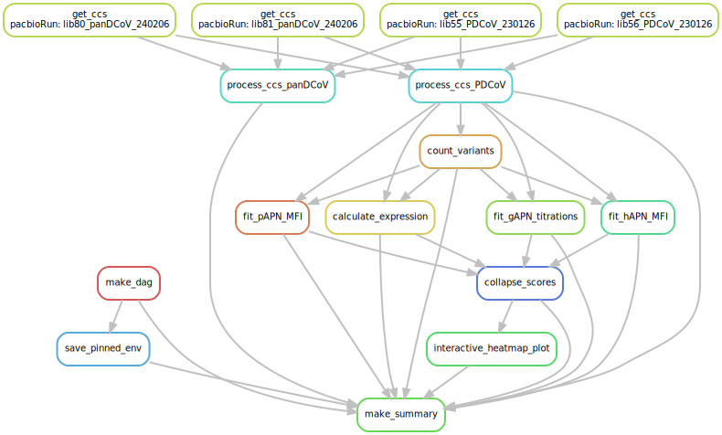

# Summary

Analysis run by [Snakefile](../../Snakefile)
using [this config file](../../config.yaml).
See the [README in the top directory](../../README.md)
for details.

Here is the DAG of the computational workflow:

Here is the Markdown output of each Jupyter notebook in the
workflow:

1. Process PacBio CCSs for [PDCoV libraries](process_ccs_PDCoV.md) and [pan-delta-CoV](process_ccs_panDCoV.md) libraries. Creates barcode-variant lookup tables, which can be found here for [PD-CoV](../variants/codon_variant_table_PDCoV.csv) and [pan-delta-CoV](../variants/codon_variant_table_PDCoV.csv) libraries.

2. [Count variants by barcode](count_variants.md).
   Creates a [variant counts file](../counts/variant_counts.csv)
   giving counts of each barcoded variant in each condition.

3. [Fit gAPN titration curves](compute_gAPN_Kd.md) to calculate per-barcode KD, recorded in [this file](../binding_scores/gAPN_bc_binding.csv).

4. Analyze single-concentration sort-seq experients for [hAPN](compute_hAPN_meanF.md) and [pAPN](compute_pAPN_meanF.md) to calculate per-barcode binding MFI, recorded in these files for [hAPN](../binding_scores/hAPN_bc_binding.csv) and [pAPN](../binding_scores/pAPN_bc_binding.csv).

5. [Analyze Sort-seq](compute_expression_meanF.md) to calculate per-barcode RBD expression, recorded in [this file](../expression_meanF/bc_expression.csv).

6. [Derive final genotype-level phenotypes from replicate barcoded sequences](collapse_scores.md).
   Generates final phenotypes, recorded in [this file](../final_variant_scores/final_variant_scores.csv).

7. Make interactive data visualizations, available [here](https://tstarrlab.github.io/PD-CoV-RBD_DMS/)